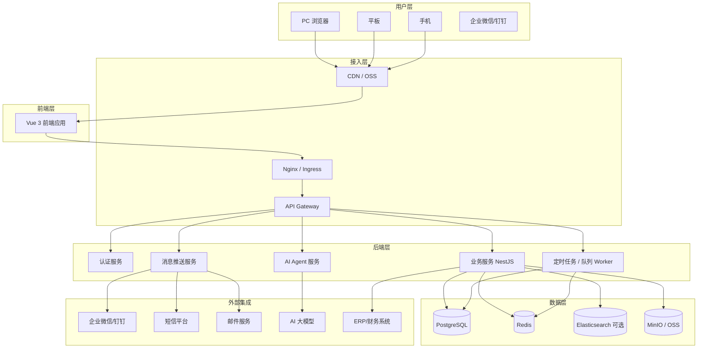
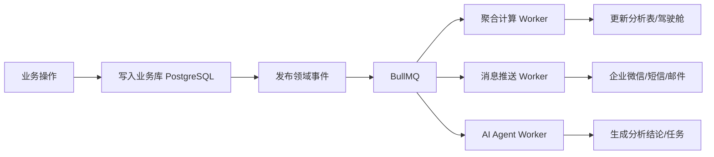

# XQCOP 技术架构方案

> 本文档基于 `XQCOP-领域建模方案.md` 中的业务领域设计，给出系统的技术选型、分层架构、数据架构、部署架构、安全设计和技术演进路线。

---

## 1. 架构设计目标

| 目标 | 说明 |
|---|---|
| 支撑业务快速迭代 | 22+ 业务模块可独立开发、独立部署、独立扩展 |
| 保持原型 1:1 还原 | 前端视觉与交互必须与高保真原型一致 |
| 领域驱动落地 | 后端架构与领域模型一一对应，避免贫血模型 |
| 高可用与可扩展 | 核心业务 99.9% 可用，支持水平扩展 |
| 数据安全合规 | 权限控制到字段级，操作全程留痕 |
| 降低长期维护成本 | 统一技术栈、统一组件库、统一接口规范 |

---

## 2. 总体技术架构

### 2.1 技术栈

| 层级 | 技术选型 | 版本建议 |
|---|---|---|
| 前端框架 | Vue 3 + Vite + TypeScript | Vue 3.5+ / Vite 8+ |
| UI 组件库 | Ant Design Vue 4 + 自研 Xq 组件库 | 4.2+ |
| 状态管理 | Pinia | 4.0+ |
| 路由 | Vue Router 5 | 5.2+ |
| 样式方案 | Tailwind CSS 4 | 4.3+ |
| 后端框架 | NestJS | 11+ |
| ORM | Prisma | 6+ |
| 数据库 | PostgreSQL | 16+ |
| 缓存/会话/队列 | Redis | 7+ |
| 消息队列 | BullMQ（基于 Redis） | - |
| 任务调度 | NestJS Schedule + BullMQ | - |
| 文件存储 | MinIO（开发/测试）/ 阿里云 OSS（生产） | - |
| 全文检索 | PostgreSQL tsvector（初期）/ Elasticsearch（可选） | - |
| 容器化 | Docker + docker-compose | - |
| 生产部署 | Kubernetes | - |
| 网关 | Nginx / Ingress Controller | - |
| 监控 | Prometheus + Grafana + Loki | - |
| 日志 | Pino / Winston + ELK / Loki | - |

### 2.2 总体架构图



---

## 3. 分层架构

### 3.1 前端分层

```
src/
├── api/              # 接口层：按领域模块组织 API
├── assets/           # 静态资源
├── components/       # 公共组件 + Xq 业务组件库
├── composables/      # 组合式函数
├── layouts/          # 布局组件
├── router/           # 路由配置
├── stores/           # Pinia Store，按领域拆分
├── styles/           # 全局样式 + Tailwind + Design Tokens
├── utils/            # 工具函数
├── views/            # 页面视图，按领域模块组织
└── types/            # 全局类型
```

#### 前端架构原则

- **视图与逻辑分离**：页面只负责布局和数据绑定，业务逻辑放在 composables 或 store。
- **组件库统一**：所有页面使用 Xq 组件库 + Ant Design Vue，禁止自行实现重复组件。
- **状态按域拆分**：每个业务域一个 Pinia Store，避免单文件过大。
- **接口类型共享**：通过 OpenAPI 生成 TS 类型，前后端类型一致。

### 3.2 后端分层（DDD 六边形架构）

```
server/src/
├── main.ts
├── app.module.ts
├── config/                 # 配置管理
├── common/                 # 公共基础设施
│   ├── decorators/         # 装饰器
│   ├── filters/            # 异常过滤器
│   ├── guards/             # 权限守卫
│   ├── interceptors/       # 拦截器
│   ├── pipes/              # 管道
│   └── dto/                # 公共 DTO
├── modules/                # 业务模块，每个限界上下文一个目录
│   ├── auth/               # 认证授权
│   ├── user/               # 用户组织
│   ├── customer/           # 客户管理
│   ├── lead/               # 线索管理
│   ├── intention/          # 意向管理
│   ├── product/            # 产品品牌
│   ├── equipment/          # 设备管理
│   ├── ticket/             # 工单管理
│   ├── dealer/             # 经销商协同
│   ├── channel-order/      # 渠道秩序
│   ├── rebate/             # 返利与佣金
│   ├── task/               # 任务管理
│   ├── approval/           # 审批中心
│   ├── performance/        # 目标绩效
│   ├── compliance/         # 合规风控
│   ├── qualification/      # 资质管理
│   ├── dashboard/          # 经营驾驶舱
│   ├── benefit/            # 效益中心
│   ├── insight/            # 数据洞察
│   ├── deal-room/          # 大单作战室
│   ├── custom-project/     # 定制项目
│   ├── ai-agent/           # AI Agent
│   └── config/             # 应用配置
├── domain/                 # 跨模块的共享领域对象（可选）
├── prisma/
│   ├── schema.prisma       # 数据模型
│   └── migrations/         # 迁移脚本
└── test/                   # 测试
```

#### 后端模块内部结构

每个业务模块统一按下面结构组织：

```
modules/customer/
├── customer.module.ts
├── customer.controller.ts      # API 入口
├── customer.service.ts         # 应用服务
├── customer.repository.ts      # 仓储接口
├── customer.prisma-repository.ts # 仓储实现
├── dto/
│   ├── create-customer.dto.ts
│   ├── update-customer.dto.ts
│   └── query-customer.dto.ts
├── entities/
│   └── customer.entity.ts      # 领域实体
├── domain/
│   └── customer-domain.service.ts # 领域服务
├── events/
│   └── customer-created.event.ts
└── customer.subscriber.ts      # 事件订阅
```

#### 后端分层原则

| 层级 | 职责 | 禁止做的事 |
|---|---|---|
| Controller | 接收请求、参数校验、返回响应 | 不写业务逻辑 |
| Application Service | 编排领域对象、处理用例流程 | 不包含领域规则 |
| Domain Service | 跨聚合业务逻辑 | 不直接操作数据库 |
| Repository | 数据持久化抽象 | 不包含业务逻辑 |
| Infrastructure | 数据库、缓存、消息队列实现 | 不依赖具体业务 |

---

## 4. 数据架构

### 4.1 数据库设计原则

- **一域一 Schema**：不同限界上下文的数据库表使用 Schema 隔离，便于未来拆分微服务。
- **主键统一使用 CUID**：避免自增 ID 暴露数据量，便于分布式系统扩展。
- **审计字段统一**：每个表必须包含 `createdAt`、`updatedAt`、`createdBy`、`updatedBy`。
- **软删除优先**：核心业务数据使用 `deletedAt` 软删除，保留历史。
- **索引规范**：外键、查询字段、时间范围字段必须加索引。

### 4.2 核心数据流向



### 4.3 读写分离策略

| 场景 | 处理方式 |
|---|---|
| 业务操作 | 写主库 PostgreSQL |
| 列表查询 | 读主库 + Redis 缓存 |
| 驾驶舱/报表 | 读分析聚合表，避免实时 JOIN |
| 全文检索 | 初期用 PostgreSQL tsvector，数据量大后切 ES |

### 4.4 缓存策略

| 数据类型 | 缓存方式 | 过期时间 |
|---|---|---|
| 用户权限 | Redis Hash | 30 分钟 |
| 字典数据 | Redis String | 1 小时 |
| 客户 360° 聚合数据 | Redis Hash | 5 分钟 |
| 驾驶舱指标 | Redis String | 5-15 分钟 |
| 会话 Token | Redis String | 与 JWT 过期时间一致 |

---

## 5. 服务间通信

### 5.1 同步通信

- **内部 HTTP API**：模块间需要强一致性查询时，通过内部 API 调用。
- **使用案例**：工单管理查询设备信息、审批中心查询用户信息。

### 5.2 异步通信

- **领域事件 + BullMQ**：模块间解耦，适用于最终一致性场景。
- **使用案例**：线索转化后通知绩效域、工单完成后通知客户健康度计算。

### 5.3 事件总线设计

```typescript
// 事件发布
@EventPattern('lead.converted')
async handleLeadConverted(data: LeadConvertedEvent) {
  await this.performanceService.recalculate(data.customerId)
}

// 事件订阅
@OnEvent('lead.converted')
async onLeadConverted(event: LeadConvertedEvent) {
  await this.messageService.sendLeadConvertedNotification(event)
}
```

---

## 6. 安全架构

### 6.1 认证授权

- **JWT + Refresh Token**：Access Token 有效期 2 小时，Refresh Token 有效期 7 天。
- **RBAC + 数据权限**：角色控制功能权限，数据权限控制可见范围。
- **字段级权限**：敏感字段通过 DTO 脱敏，超管操作记录审计日志。

### 6.2 接口安全

- **HTTPS 全站**：生产环境强制 HTTPS。
- **接口限流**：基于 Redis 实现滑动窗口限流。
- **防重放攻击**：关键接口增加请求时间戳和幂等键。
- **SQL 注入防护**：使用 Prisma ORM，禁止拼接 SQL。
- **XSS 防护**：前端输出转义，后端存储不执行用户输入。

### 6.3 数据安全

- **敏感字段加密**：手机号、身份证号等字段数据库加密存储。
- **操作审计**：关键操作记录 who/when/what/result。
- **数据备份**：PostgreSQL 每日全量备份 + WAL 增量备份。
- **最小权限原则**：数据库账号按应用拆分，禁止 root 直连。

---

## 7. 部署架构

### 7.1 开发环境

```yaml
# docker-compose.dev.yml
services:
  app:
    build: .
    ports:
      - "3000:3000"
  web:
    build: ./web
    ports:
      - "8080:80"
  postgres:
    image: postgres:16
    ports:
      - "5432:5432"
  redis:
    image: redis:7
    ports:
      - "6379:6379"
  minio:
    image: minio/minio
    ports:
      - "9000:9000"
      - "9001:9001"
```

### 7.2 生产环境（Kubernetes）

```
┌─────────────────────────────────────┐
│           Ingress Controller          │
│         SSL 终止 / 负载均衡            │
└─────────────┬───────────────────────┘
              │
┌─────────────▼───────────────────────┐
│           Frontend Pods               │
│     Vue 3 + Nginx 静态资源服务         │
└─────────────┬───────────────────────┘
              │
┌─────────────▼───────────────────────┐
│           Backend Pods                │
│      NestJS API / Worker / AI Agent   │
└─────────────┬───────────────────────┘
              │
┌─────────────▼───────────────────────┐
│     PostgreSQL HA / Redis Cluster     │
│     MinIO / OSS / Elasticsearch       │
└─────────────────────────────────────┘
```

### 7.3 CI/CD 流程

```
代码提交
  ↓
GitHub Actions / GitLab CI
  ↓
Lint + Type Check + Unit Test
  ↓
Build Docker Image
  ↓
Push to Harbor / ACR
  ↓
Deploy to K8s Dev / Test / Prod
  ↓
Health Check + Smoke Test
```

---

## 8. 关键非功能性设计

### 8.1 性能目标

| 指标 | 目标 |
|---|---|
| 页面首屏加载 | < 2 秒（PC）/ < 3 秒（移动端） |
| API 响应时间 | P99 < 500ms |
| 列表查询 | < 200ms（单页 20 条） |
| 驾驶舱加载 | < 3 秒 |
| 文件上传 | < 5 秒（10MB） |
| 并发用户 | 支持 500+ 在线用户 |

### 8.2 高可用

- 后端多 Pod 部署，支持滚动更新。
- PostgreSQL 主从 + 自动故障转移。
- Redis Cluster 高可用。
- 关键异步任务有死信队列和重试机制。

### 8.3 可观测性

| 类型 | 工具 | 内容 |
|---|---|---|
| 指标监控 | Prometheus + Grafana | QPS、响应时间、错误率、资源使用率 |
| 日志收集 | Loki / ELK | 应用日志、访问日志、审计日志 |
| 链路追踪 | Jaeger / Zipkin | 跨服务调用链 |
| 告警 | AlertManager | 接口错误率、资源阈值、业务预警 |

---

## 9. 技术演进路线

### 阶段 1：MVP（0-3 个月）

- 搭建前后端脚手架、组件库、CI/CD。
- 实现用户权限、客户管理、线索管理、意向管理。
- 单库单服务部署，Docker + docker-compose。

### 阶段 2：核心业务能力（3-6 个月）

- 补齐设备、工单、经销商、审批、任务、绩效。
- 引入 BullMQ 处理异步任务和领域事件。
- 驾驶舱基础指标上线。

### 阶段 3：智能化与深度分析（6-9 个月）

- AI Agent、数据洞察、效益中心、大单作战室。
- 引入 Elasticsearch 处理复杂检索。
- K8s 生产部署。

### 阶段 4：平台化与生态（9-12 个月）

- 微服务拆分（按限界上下文）。
- 开放平台 / 第三方系统集成。
- 多租户、国际化支持（如需要）。

---

## 10. 关键决策记录（ADR）

| 决策 | 选择 | 理由 |
|---|---|---|
| 前后端技术栈 | Vue 3 + NestJS | 与项目现状一致，团队学习成本低 |
| 数据库 | PostgreSQL | 复杂关系 + 分析能力强 |
| ORM | Prisma | 类型安全、迁移方便 |
| 缓存/队列 | Redis + BullMQ | 一物多用，部署简单 |
| 文件存储 | MinIO / OSS | 开发成本低，生产可扩展 |
| 部署 | Docker + K8s | 开发一致性与生产可扩展性兼顾 |
| 认证 | JWT + Refresh Token | 无状态、易扩展 |
| 权限 | RBAC + 数据范围 | 满足企业级权限需求 |

---

## 11. 风险与应对

| 风险 | 应对 |
|---|---|
| 原型 2.4 万行迁移工作量大 | 按模块拆分，优先核心域，视觉回归锁定 |
| NestJS 团队经验不足 | 培训 + 脚手架 + 代码审查 |
| 数据库性能瓶颈 | 先优化索引和缓存，再考虑读写分离/分库分表 |
| 领域模型频繁变更 | 建模工作坊定版，变更走评审流程 |
| 第三方集成延迟 | 先 mock 接口，不影响主流程开发 |
| AI Agent 效果不稳定 | 先聚焦确定性场景（预警、问数），逐步扩展 |

---

## 12. 下一步行动

1. **搭建开发脚手架**：前端 Xq 组件库、后端 NestJS 模块模板、Docker 开发环境。
2. **定义 API 规范**：统一接口返回格式、错误码、分页参数、OpenAPI 生成流程。
3. **输出首期模块设计**：按领域模型输出客户管理、线索管理、意向管理的详细设计。
4. **建立代码规范**：ESLint/Prettier/Commit Message 规范、分支策略。
5. **部署开发环境**：docker-compose 一键启动前端、后端、数据库、Redis、MinIO。

---

> 本文档与 `XQCOP-领域建模方案.md` 配套使用：领域模型定义「做什么」，技术架构定义「怎么做」。
