# XQCOP 完整领域建模方案

> **XQCOP** = 鑫渠业务协同运营平台（XinQu Collaborative Operation Platform）
>
> 本文档基于 DDD（领域驱动设计）方法，对 XQCOP 进行完整的领域建模，作为系统架构、数据库设计、API 设计、权限设计的底层依据。

---

## 1. 文档信息

| 项 | 内容 |
|---|---|
| 文档版本 | v1.1 |
| 适用范围 | XQCOP 全系统 |
| 建模方法 | DDD、事件风暴、四色原型法、用例驱动 |
| 相关文档 | `从原型到完整系统开发方案.md`、`领域建模方案.md`、`XQCOP领域模型-原型对齐差异报告.md` |

---

## 2. 系统概述与边界

### 2.1 系统定位

XQCOP 是面向医疗器械/IVD 行业的一体化业务协同运营平台，覆盖：

- **销售管理**：线索、意向、客户、品牌库、大单作战室、定制项目
- **售后服务**：设备、试剂、工单、维保
- **渠道协同**：经销商授权、库存、渠道绩效、渠道秩序、返利与佣金
- **运营协同**：任务、日历、审批、消息、AI Agent
- **经营分析**：目标绩效、合规风控、经营驾驶舱、效益中心、数据洞察
- **资质合规**：产品注册证、经销商资质、客户资质

### 2.2 系统边界

XQCOP 内部实现全部核心业务逻辑，外部仅与以下系统集成：

- **企业微信/钉钉**：消息推送、组织架构同步
- **企业邮箱**：邮件通知
- **短信平台**：验证码、预警短信
- **OSS/MinIO**：文件对象存储
- **ERP/财务系统**（未来）：订单、回款数据同步
- **BI 工具**（未来）：深度数据分析

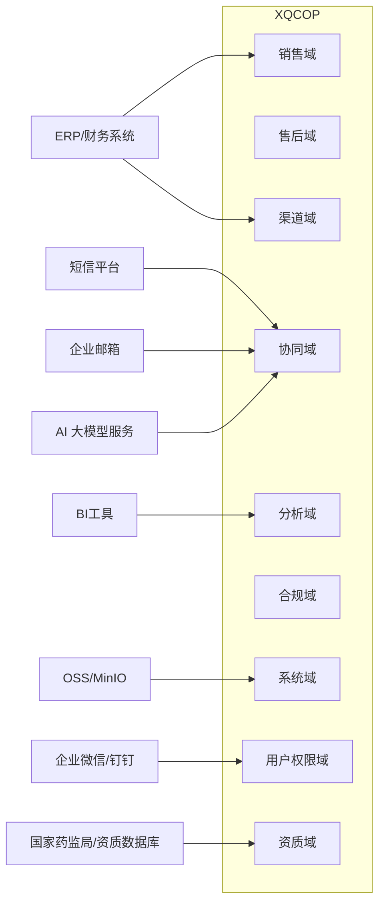

---

## 3. 限界上下文（Bounded Context）

限界上下文是 DDD 中最重要的概念之一，它划定了领域模型的有效边界。同一个术语在不同上下文中含义可能不同。

### 3.1 XQCOP 限界上下文划分

| 限界上下文 | 英文 | 核心职责 | 主要聚合 |
|---|---|---|---|
| 用户与权限 | Identity & Access | 账号、角色、部门、数据权限 | User, Role, Department, Permission |
| 线索管理 | Lead Management | 线索获取、分配、跟进、转化 | Lead, LeadFollowRecord |
| 客户管理 | Customer Management | 客户档案、联系人、拜访记录 | Customer, Contact, VisitRecord |
| 意向管理 | Opportunity Management | 商机/意向跟进、赢单输单 | Intention, IntentionStageRecord |
| 产品品牌 | Product Catalog | 产品、品牌、价格体系 | Product, Brand, ProductCategory |
| 设备管理 | Equipment Management | 设备档案、质保、维保计划 | Equipment, MaintenancePlan |
| 试剂运营 | Reagent Operations | 试剂库存、消耗、补货 | Reagent, ReagentStock, ReagentOrder |
| 工单管理 | Ticket Management | 售后服务工单全生命周期 | Ticket, TicketProcessRecord |
| 经销商协同 | Dealer Collaboration | 经销商授权、库存、返利 | Dealer, DealerStock, DealerRebate |
| 任务管理 | Task Management | 任务创建、分配、跟踪 | Task, TaskComment |
| 日历日程 | Calendar | 日程安排、提醒 | Schedule, ScheduleReminder |
| 审批中心 | Approval Center | 流程审批、会签、转交 | ApprovalInstance, ApprovalTask |
| 消息通知 | Notification | 站内信、推送、消息模板 | Message, MessageTemplate |
| 目标绩效 | Performance | 目标拆解、达成计算、排名 | Performance, PerformanceTarget |
| 合规风控 | Compliance | 合规证据、飞检、整改 | ComplianceRecord, ComplianceEvidence |
| 经营驾驶舱 | Dashboard | 数据看板、指标聚合 | DashboardConfig, DashboardMetric |
| 应用配置 | App Configuration | 应用中心、菜单、字典 | App, Dictionary, Menu |
| 流程设计器 | Process Designer | 审批流程模板设计 | ApprovalTemplate, FlowNode |
| AI Agent | AI Agent Center | 数字员工配置、调度、训练、监控 | Agent, AgentConfig, AgentExecution |
| 资质管理 | Qualification Management | 产品注册证、经销商资质、客户资质 | Qualification, QualificationType |
| 效益中心 | Benefit Center | 营收、回款、毛利、应收账龄 | BenefitReport, AgingReport |
| 数据洞察 | Data Insight | 转化漏斗、丢单原因、区域效率 | InsightReport, ConversionFunnel |
| 大单作战室 | Deal Room | 重大项目、风险、资源协同 | DealRoomProject, DealRoomRisk |
| 定制项目 | Custom Project | 非标准化项目配置与推进 | CustomProject, CustomProjectTemplate |
| 渠道秩序 | Channel Order | 区域保护、撞单、越区出货、冲突裁决 | ChannelProtectionRule, ChannelConflict, ShipmentOrder |
| 返利与佣金 | Rebate & Commission | 返利政策、结算、佣金发放 | RebatePolicy, RebateSettlement, CommissionRecord |

### 3.2 上下文映射（Context Map）

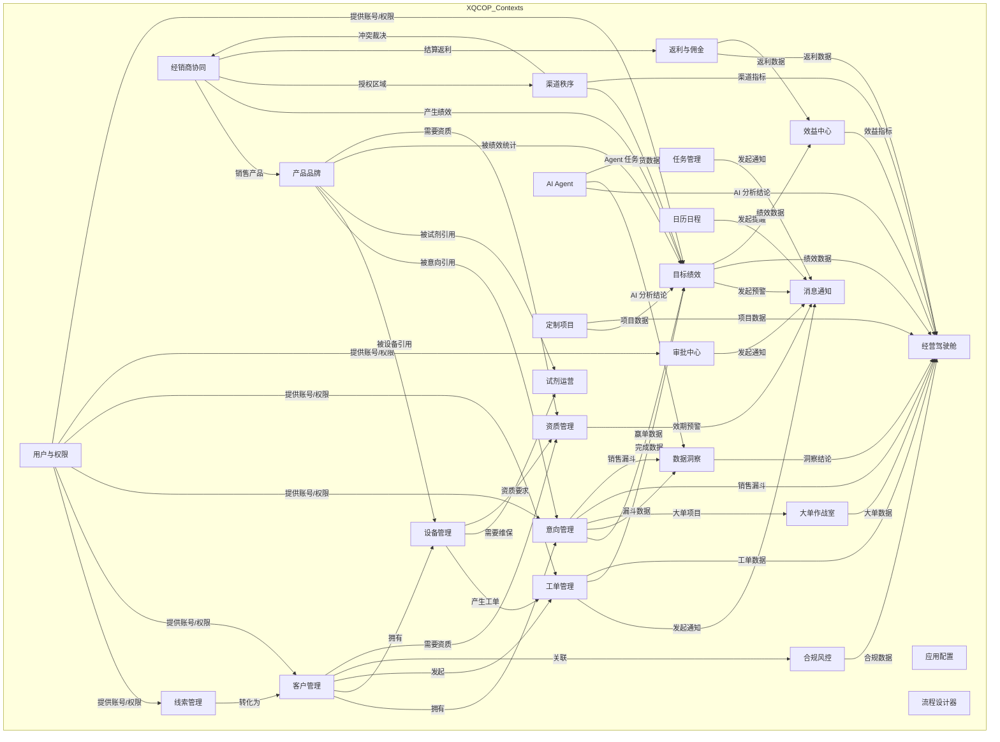

### 3.3 集成模式

| 上下文关系 | 模式 | 说明 |
|---|---|---|
| 销售域 ↔ 客户域 | 共享内核 | Customer 是核心资产，双方共享 |
| 审批中心 → 消息通知 | 发布-订阅 | 审批事件发布，消息中心订阅 |
| 工单管理 → 设备管理 | 客户-供应商 | 工单依赖设备信息，通过 API 查询 |
| 经营驾驶舱 → 各业务域 | 开放主机服务 | 驾驶舱通过只读 API 聚合各域数据 |
| 用户权限域 → 各业务域 | 客户-供应商 | 各业务域通过权限服务校验 |
| 经销商协同 → 渠道秩序 | 客户-供应商 | 渠道秩序依赖经销商授权区域 |
| 经销商协同 → 返利与佣金 | 客户-供应商 | 返利结算依赖经销商销售数据 |
| 销售域 → 数据洞察 | 发布-订阅 | 销售事件驱动洞察报告更新 |
| 销售域 → 大单作战室 | 客户-供应商 | 大单作战室引用意向/项目数据 |
| AI Agent → 任务/驾驶舱 | 发布-订阅 | Agent 任务和结论通过事件分发 |
| 资质管理 → 设备/产品/经销商 | 客户-供应商 | 资质校验依赖基础资料 |

---

## 4. 统一语言（Ubiquitous Language）

### 4.1 核心术语

| 中文 | 英文 | 定义 | 所属上下文 |
|---|---|---|---|
| 用户 | User | 系统登录账号，可关联角色和部门 | 用户与权限 |
| 角色 | Role | 权限集合，定义可操作功能和数据范围 | 用户与权限 |
| 部门 | Department | 组织架构单元，树形层级 | 用户与权限 |
| 数据权限范围 | Data Scope | 用户可见数据的范围：本人/本部门/本区域/全部 | 用户与权限 |
| 客户 | Customer | 购买或使用产品的机构主体，如医院、检验中心 | 客户管理 |
| 联系人 | Contact | 客户机构内的具体对接人 | 客户管理 |
| 拜访记录 | Visit Record | 销售人员拜访客户的过程记录 | 客户管理 |
| 线索 | Lead | 尚未确认合作意向的潜在客户信息 | 线索管理 |
| 公海池 | Public Pool | 无人跟进或已释放的线索集合 | 线索管理 |
| 线索来源 | Lead Source | 线索获取渠道，如展会、官网、转介绍 | 线索管理 |
| 意向 | Intention | 客户对某产品/服务的明确采购意向 | 意向管理 |
| 意向阶段 | Intention Stage | 意向推进阶段，如初洽、报价、合同 | 意向管理 |
| 赢单 | Won | 意向成功达成销售 | 意向管理 |
| 输单 | Lost | 意向未达成 | 意向管理 |
| 停滞 | Stalled | 意向长期无进展 | 意向管理 |
| 产品 | Product | 可销售的产品或品牌 | 产品品牌 |
| 产品线 | Product Line | 产品分类，如血球、生化、免疫 | 产品品牌 |
| 设备 | Equipment | 已售出的仪器/设备，绑定客户 | 设备管理 |
| 序列号 | Serial Number | 设备唯一标识 | 设备管理 |
| 质保期 | Warranty Period | 设备免费维修服务期限 | 设备管理 |
| 工单 | Ticket | 售后服务请求或问题处理单 | 工单管理 |
| 工单类型 | Ticket Type | 安装、维修、保养、投诉等 | 工单管理 |
| 工单优先级 | Ticket Priority | 紧急/高/中/低 | 工单管理 |
| 处理记录 | Process Record | 工单处理过程的记录 | 工单管理 |
| 经销商 | Dealer | 代理销售产品的渠道商 | 经销商协同 |
| 授权区域 | Authorized Region | 经销商被授权销售的地理范围 | 经销商协同 |
| 返利 | Rebate | 根据销售业绩返还给经销商的金额 | 经销商协同 |
| 任务 | Task | 分配给人员的待办事项 | 任务管理 |
| 日程 | Schedule | 日历上的预约、拜访、会议安排 | 日历日程 |
| 审批实例 | Approval Instance | 一次具体审批流程的运行时对象 | 审批中心 |
| 审批任务 | Approval Task | 审批流程中某个节点的待办任务 | 审批中心 |
| 审批模板 | Approval Template | 预定义的审批流程模型 | 流程设计器 |
| 绩效 | Performance | 某对象在特定周期的目标与达成情况 | 目标绩效 |
| 达成率 | Achievement Rate | 完成额 / 目标额 | 目标绩效 |
| 缺口 | Gap | 目标额 - 完成额 | 目标绩效 |
| 同比 | YoY | 与去年同期对比 | 目标绩效 |
| 合规记录 | Compliance Record | 拜访、活动、样品、飞检等合规证据 | 合规风控 |
| 证据链 | Evidence Chain | 合规相关的完整证明材料集合 | 合规风控 |
| 驾驶舱 | Dashboard | 数据可视化分析看板 | 经营驾驶舱 |
| 应用 | App | 应用中心中的功能模块入口 | 应用配置 |
| 字典 | Dictionary | 可配置的基础数据分类 | 应用配置 |
| 客户等级 | Customer Level | 客户分层，如战略客户、普通客户 | 客户管理 |
| 关系健康度 | Relationship Health Score | 客户关系的综合评分 | 客户管理 |
| 客户科室 | Customer Department | 医院内部科室，如检验科、康复科 | 客户管理 |
| 决策链 | Decision Chain | 客户采购决策相关角色链路 | 客户管理 |
| 投放模式 | Placement Mode | 设备的销售/TP/捐赠/租赁方式 | 设备管理 |
| 维保类型 | Warranty Type | 原厂质保/延保/第三方维保/无 | 设备管理 |
| 利用率 | Utilization Rate | 设备实际使用频率指标 | 设备管理 |
| 试剂账本 | Reagent Ledger | 客户试剂消耗与库存记录 | 试剂运营 |
| 工单号 | Ticket Number | 工单唯一编号 | 工单管理 |
| 剩余 SLA | Remaining SLA | 工单剩余服务级别时间 | 工单管理 |
| AI 数字员工 | AI Agent | 可配置执行的 AI 自动化任务单元 | AI Agent |
| Agent 配置 | Agent Config | 数字员工的技能、触发条件、训练数据 | AI Agent |
| 资质证照 | Qualification | 产品注册证、经销商资质、客户资质 | 资质管理 |
| 资质类型 | Qualification Type | 证照分类，如注册证、经营许可证 | 资质管理 |
| 效益中心 | Benefit Center | 营收、回款、毛利、应收账龄分析 | 效益中心 |
| 应收账龄 | AR Aging | 应收账款按账龄分布 | 效益中心 |
| 数据洞察 | Data Insight | 转化漏斗、丢单原因、区域效率分析 | 数据洞察 |
| 大单项目 | Deal Room Project | 金额超过阈值的重点项目 | 大单作战室 |
| 大单风险 | Deal Room Risk | 大单项目中的风险项 | 大单作战室 |
| 定制项目 | Custom Project | 非标准化的大型项目 | 定制项目 |
| 渠道保护规则 | Channel Protection Rule | 经销商区域保护规则 | 渠道秩序 |
| 渠道冲突 | Channel Conflict | 撞单、越区出货等冲突 | 渠道秩序 |
| 出货单 | Shipment Order | 产品出货记录 | 渠道秩序 |
| 返利政策 | Rebate Policy | 按采购额阶梯返利的规则 | 返利与佣金 |
| 返利结算单 | Rebate Settlement | 季度/年度返利结算记录 | 返利与佣金 |
| 佣金 | Commission | 销售/渠道人员提成 | 返利与佣金 |

### 4.2 术语使用规范

- 所有文档、代码、接口、数据库字段必须使用统一语言。
- 禁止在代码中使用 `user1`、`item`、`info` 等模糊命名。
- 中文术语在接口中统一转译，如「线索」必须为 `lead`，不可混用 `clue`、`potential` 等。

---

## 5. 核心子域与聚合设计

### 5.1 子域分类

| 类型 | 子域 | 战略重要性 | 投入度 |
|---|---|---|---|
| 核心域 | 销售域、客户域、售后域 | 最高 | 内部自建，重点投入 |
| 支撑域 | 协同域、渠道域、合规域、资质域 | 高 | 内部自建 |
| 通用域 | 用户权限域、系统域、消息通知、AI Agent | 中 | 可部分复用开源/云服务/大模型 |
| 分析域 | 绩效域、驾驶舱、效益中心、数据洞察 | 高 | 内部自建，依赖核心域数据 |

### 5.2 聚合根清单

| 上下文 | 聚合根 | 聚合内实体 | 值对象 |
|---|---|---|---|
| 用户与权限 | User | - | Permission, DataScope |
| 用户与权限 | Department | - | - |
| 用户与权限 | Role | - | Permission |
| 线索管理 | Lead | LeadFollowRecord, LeadAssignRecord | LeadSource, LeadLevel |
| 客户管理 | Customer | Contact, VisitRecord | Address, CustomerTag |
| 意向管理 | Intention | IntentionStageRecord, IntentionProduct | Money, Probability |
| 产品品牌 | Product | ProductSpec | Money, ProductCategory |
| 设备管理 | Equipment | MaintenanceRecord, EquipmentFault | WarrantyPeriod, SerialNumber |
| 试剂运营 | Reagent | ReagentStock, ReagentOrder | ReagentBatch |
| 工单管理 | Ticket | TicketProcessRecord, TicketAttachment | TicketPriority |
| 经销商协同 | Dealer | DealerAuthorization, DealerStock, DealerRebate | AuthorizedRegion |
| 任务管理 | Task | TaskComment, TaskAttachment | TaskPriority |
| 日历日程 | Schedule | ScheduleReminder | TimeRange |
| 审批中心 | ApprovalInstance | ApprovalTask, ApprovalComment | ApprovalAction |
| 流程设计器 | ApprovalTemplate | FlowNode, FlowEdge | FlowCondition |
| 消息通知 | Message | - | MessageChannel |
| 目标绩效 | Performance | PerformanceTarget | PerformanceCycle |
| 合规风控 | ComplianceRecord | ComplianceEvidence | ComplianceType |
| 经营驾驶舱 | DashboardConfig | DashboardWidget | WidgetType |
| 应用配置 | App | Menu | AppCategory |
| 应用配置 | Dictionary | - | DictionaryItem |
| AI Agent | Agent | AgentConfig, AgentExecution | AgentCapability |
| AI Agent | AgentTraining | TrainingRecord, FeedbackRecord | FeedbackType |
| 资质管理 | Qualification | QualificationFile, QualificationRenewal | QualificationType |
| 效益中心 | BenefitReport | AgingReport, RevenueReport | ReportPeriod |
| 数据洞察 | InsightReport | ConversionFunnel, LossReasonAnalysis | InsightDimension |
| 大单作战室 | DealRoomProject | DealRoomRisk, DealRoomMilestone | DealRoomStage |
| 定制项目 | CustomProject | CustomProjectStage, CustomProjectTemplate | ProjectType |
| 渠道秩序 | ChannelProtectionRule | ChannelConflict, ShipmentOrder | ConflictType |
| 返利与佣金 | RebatePolicy | RebateSettlement, CommissionRecord | RebateTier |

---

## 6. 核心领域模型详解

### 6.1 用户与权限上下文

#### 聚合根：User（用户）

```typescript
class User {
  id: UserId
  username: string
  name: string
  phone: string
  email: string
  departmentId: DepartmentId
  roleIds: RoleId[]
  status: UserStatus
  createdAt: DateTime
  updatedAt: DateTime

  assignRole(roleId: RoleId): void
  transferDepartment(deptId: DepartmentId): void
  disable(): void
  enable(): void
}
```

#### 聚合根：Role（角色）

```typescript
class Role {
  id: RoleId
  name: string
  code: string
  permissions: Permission[]
  dataScope: DataScope
  status: Status

  grantPermission(permission: Permission): void
  revokePermission(permission: Permission): void
  setDataScope(scope: DataScope): void
}
```

#### 聚合根：Department（部门）

```typescript
class Department {
  id: DepartmentId
  name: string
  parentId: DepartmentId | null
  leaderId: UserId | null
  path: string
  sortOrder: number

  moveTo(parentId: DepartmentId): void
  setLeader(userId: UserId): void
}
```

#### 值对象

```typescript
class Permission {
  resource: string
  action: 'create' | 'read' | 'update' | 'delete' | 'export' | 'approve'
}

enum DataScope {
  SELF = 'SELF',                    // 仅本人
  DEPT = 'DEPT',                    // 本部门
  DEPT_AND_CHILD = 'DEPT_AND_CHILD', // 本部门及下级
  REGION = 'REGION',                // 本区域
  ALL = 'ALL'                       // 全部
}
```

---

### 6.2 销售上下文

#### 聚合根：Lead（线索）

```typescript
class Lead {
  id: LeadId
  name: string
  source: LeadSource
  sourceDetail: string
  status: LeadStatus
  poolType: PoolType
  ownerId: UserId | null
  region: string
  contactName: string
  contactPhone: string
  companyName: string
  intentionLevel: IntentionLevel
  followCount: number
  lastFollowAt: DateTime | null
  convertedCustomerId: CustomerId | null
  createdAt: DateTime
  updatedAt: DateTime

  assignTo(userId: UserId): void
  follow(record: LeadFollowRecord): void
  convertToCustomer(customerId: CustomerId): void
  markAsInvalid(reason: string): void
  returnToPublicPool(): void
  claimBy(userId: UserId): void
}

class LeadFollowRecord {
  id: LeadFollowRecordId
  leadId: LeadId
  followerId: UserId
  followType: FollowType
  content: string
  nextFollowAt: DateTime | null
  createdAt: DateTime
}

enum LeadStatus {
  PENDING = 'PENDING',          // 待分配
  FOLLOWING = 'FOLLOWING',      // 跟进中
  CONVERTED = 'CONVERTED',      // 已转化
  INVALID = 'INVALID'           // 已失效
}

enum PoolType {
  MINE = 'MINE',
  PUBLIC = 'PUBLIC',
  TEAM = 'TEAM'
}

enum LeadSource {
  OFFICIAL_WEBSITE = '官网注册',
  EXHIBITION = '展会',
  REFERRAL = '转介绍',
  HOTLINE = '400电话',
  DEALER_RECOMMENDATION = '代理商推荐',
  ACADEMIC_ACTIVITY = '学术活动'
}
```

#### 聚合根：Customer（客户）

```typescript
class Customer {
  id: CustomerId
  name: string
  type: CustomerType          // 综合医院 / 肿瘤专科 / 妇幼医院等
  hospitalLevel: HospitalLevel // 三级甲等 / 三级乙等 / 二级医院等
  region: string
  address: Address
  ownerId: UserId
  status: CustomerStatus
  level: CustomerLevel        // 战略客户 / 普通客户
  healthScore: number         // 关系健康度 0-100
  tags: CustomerTag[]
  source: string
  createdAt: DateTime
  updatedAt: DateTime

  contacts: Contact[]
  departments: CustomerDepartment[]
  decisionChains: DecisionChainNode[]
  visitRecords: VisitRecord[]
  intentions: Intention[]
  equipments: Equipment[]
  reagentLedger: ReagentLedger[]
  tickets: Ticket[]

  addContact(contact: Contact): void
  removeContact(contactId: ContactId): void
  setPrimaryContact(contactId: ContactId): void
  addDepartment(department: CustomerDepartment): void
  removeDepartment(departmentId: CustomerDepartmentId): void
  addDecisionChainNode(node: DecisionChainNode): void
  updateHealthScore(score: number): void
  changeOwner(userId: UserId): void
  addTag(tag: CustomerTag): void
  removeTag(tag: CustomerTag): void
  markAsLost(reason: string): void
  markAsCooperating(): void
}

class Contact {
  id: ContactId
  customerId: CustomerId
  name: string
  phone: string
  email: string
  position: string
  departmentId: CustomerDepartmentId
  decisionRole: DecisionRole    // 决策人 / 影响人 / 使用人
  isPrimary: boolean
  status: Status
}

class CustomerDepartment {
  id: CustomerDepartmentId
  customerId: CustomerId
  name: string                    // 检验科 / 康复科 / 设备科
  bedCount: number | null         // 床位数（可选）
  remark: string
}

class DecisionChainNode {
  id: DecisionChainNodeId
  customerId: CustomerId
  contactId: ContactId
  role: DecisionRole
  influenceLevel: number          // 影响力 1-5
  decisionArea: string            // 负责决策范围
}

class VisitRecord {
  id: VisitRecordId
  customerId: CustomerId
  visitorId: UserId
  visitType: VisitType
  visitTime: DateTime
  content: string
  location: string
  attachments: Attachment[]
  createdAt: DateTime
}

enum CustomerType {
  GENERAL_HOSPITAL = '综合医院',
  TUMOR_SPECIALIST = '肿瘤专科',
  WOMEN_CHILDREN = '妇幼医院',
  LAB_CENTER = '第三方检验中心',
  OTHER = '其他'
}

enum HospitalLevel {
  LEVEL_3A = '三级甲等',
  LEVEL_3B = '三级乙等',
  LEVEL_2 = '二级医院',
  LEVEL_1 = '一级医院'
}

enum CustomerLevel {
  STRATEGIC = '战略客户',
  NORMAL = '普通客户'
}

enum DecisionRole {
  DECISION_MAKER = '决策人',
  INFLUENCER = '影响人',
  USER = '使用人',
  GATEKEEPER = '把关人'
}
```

#### 聚合根：Intention（意向）

```typescript
class Intention {
  id: IntentionId
  customerId: CustomerId
  productId: ProductId
  amount: Money
  stage: IntentionStage
  probability: number
  expectedAt: DateTime
  ownerId: UserId
  status: IntentionStatus
  createdAt: DateTime
  updatedAt: DateTime

  advanceStage(stage: IntentionStage, probability: number, remark: string): void
  markAsWon(actualAmount: Money): void
  markAsLost(reason: string): void
  markAsStalled(reason: string): void
  reactivate(): void
  assignTo(userId: UserId): void
  changeAmount(amount: Money, reason: string): void
}

class IntentionStageRecord {
  id: IntentionStageRecordId
  intentionId: IntentionId
  fromStage: IntentionStage
  toStage: IntentionStage
  probability: number
  operatorId: UserId
  remark: string
  createdAt: DateTime
}

enum IntentionStage {
  INITIAL = 'INITIAL',
  NEGOTIATION = 'NEGOTIATION',
  QUOTATION = 'QUOTATION',
  CONTRACT = 'CONTRACT',
  WON = 'WON'
}

enum IntentionStatus {
  ACTIVE = 'ACTIVE',
  WON = 'WON',
  LOST = 'LOST',
  STALLED = 'STALLED'
}
```

#### 聚合根：Product（产品）

```typescript
class Product {
  id: ProductId
  name: string
  code: string
  category: ProductCategory
  brand: string
  unit: string
  price: Money
  description: string
  status: Status
  createdAt: DateTime
  updatedAt: DateTime
}
```

---

### 6.3 售后上下文

#### 聚合根：Equipment（设备）

```typescript
class Equipment {
  id: EquipmentId
  customerId: CustomerId
  productId: ProductId
  customerDepartmentId: CustomerDepartmentId | null
  serialNumber: string
  placementMode: PlacementMode      // 销售 / TP / 捐赠 / 租赁
  warrantyType: WarrantyType        // 原厂质保 / 延保 / 第三方维保 / 无
  installAt: DateTime
  warrantyStartAt: DateTime
  warrantyEndAt: DateTime
  status: EquipmentStatus
  location: string
  utilizationRate: number           // 利用率 0-100%
  ownerId: UserId
  createdAt: DateTime
  updatedAt: DateTime

  install(installAt: DateTime, location: string): void
  renewWarranty(endAt: DateTime, warrantyType: WarrantyType): void
  requestMaintenance(): MaintenanceRecord
  reportFault(description: string): EquipmentFault
  updateUtilizationRate(rate: number): void
  scrap(reason: string): void
}

class MaintenanceRecord {
  id: MaintenanceRecordId
  equipmentId: EquipmentId
  type: MaintenanceType
  plannedAt: DateTime
  completedAt: DateTime | null
  operatorId: UserId | null
  result: string
  status: MaintenanceStatus
}

class EquipmentFault {
  id: EquipmentFaultId
  equipmentId: EquipmentId
  description: string
  reportedAt: DateTime
  status: FaultStatus
}

enum EquipmentStatus {
  IN_TRANSIT = '在途',
  INSTALLED = '已装机',
  RUNNING = '运行中',
  UNDER_REPAIR = '维修中',
  IDLE = '闲置',
  SCRAPPED = '报废'
}

enum PlacementMode {
  SALES = '销售',
  TP = 'TP',
  DONATION = '捐赠',
  LEASE = '租赁'
}

enum WarrantyType {
  MANUFACTURER = '原厂质保',
  EXTENDED = '延保',
  THIRD_PARTY = '第三方维保',
  NONE = '无'
}
```

#### 聚合根：Ticket（工单）

```typescript
class Ticket {
  id: TicketId
  ticketNumber: string              // 工单唯一编号，如 WO-20260729-0001
  customerId: CustomerId
  equipmentId: EquipmentId | null
  type: TicketType
  priority: TicketPriority
  status: TicketStatus
  title: string
  description: string
  reporterId: UserId
  ownerId: UserId | null
  attachments: Attachment[]
  slaDeadline: DateTime             // SLA 截止时间
  slaRemainingMinutes: number       // 剩余 SLA 分钟数（计算字段）
  createdAt: DateTime
  updatedAt: DateTime

  assignTo(userId: UserId): void
  process(content: string, attachments: Attachment[], operatorId: UserId): void
  transferTo(userId: UserId, reason: string): void
  complete(operatorId: UserId): void
  customerConfirm(): void
  markAsOverdue(): void
  reopen(reason: string): void
}

class TicketProcessRecord {
  id: TicketProcessRecordId
  ticketId: TicketId
  operatorId: UserId
  action: TicketAction
  content: string
  attachments: Attachment[]
  createdAt: DateTime
}

enum TicketStatus {
  PENDING = 'PENDING',
  PROCESSING = 'PROCESSING',
  WAITING_CONFIRM = 'WAITING_CONFIRM',
  COMPLETED = 'COMPLETED',
  OVERDUE = 'OVERDUE',
  TRANSFERRED = 'TRANSFERRED'
}

enum TicketPriority {
  URGENT = 'URGENT',
  HIGH = 'HIGH',
  NORMAL = 'NORMAL',
  LOW = 'LOW'
}

enum TicketType {
  INSTALL = '安装',
  REPAIR = '维修',
  MAINTENANCE = '保养',
  INSPECTION = '巡检'
}
```

#### 聚合根：Reagent（试剂）

```typescript
class Reagent {
  id: ReagentId
  productId: ProductId
  customerId: CustomerId
  batchNo: string
  unit: string
  expireAt: DateTime
  status: ReagentStatus

  recordConsumption(quantity: number): void
  recordStockIn(quantity: number): void
  alertIfLow(stock: number, threshold: number): void
}

class ReagentLedger {
  id: ReagentLedgerId
  customerId: CustomerId
  reagentId: ReagentId
  month: string
  openingStock: number
  consumption: number
  inbound: number
  closingStock: number
  turnoverDays: number
  status: LedgerStatus
  createdAt: DateTime
}
```

---

### 6.4 渠道上下文

#### 聚合根：Dealer（经销商）

```typescript
class Dealer {
  id: DealerId
  name: string
  type: DealerType
  level: DealerLevel            // A / B / C / D 级
  region: string
  authorizedStartAt: DateTime
  authorizedEndAt: DateTime
  authorizedRegions: AuthorizedRegion[]
  creditLevel: string
  contactName: string
  contactPhone: string
  ownerId: UserId
  status: DealerStatus
  createdAt: DateTime
  updatedAt: DateTime

  renewAuthorization(start: DateTime, end: DateTime): void
  addAuthorizedRegion(region: string): void
  removeAuthorizedRegion(region: string): void
  freeze(reason: string): void
  unfreeze(): void
  changeLevel(level: DealerLevel): void
}

class DealerStock {
  id: DealerStockId
  dealerId: DealerId
  productId: ProductId
  quantity: number
  turnoverDays: number
  lastUpdatedAt: DateTime
}

enum DealerLevel {
  A = 'A',
  B = 'B',
  C = 'C',
  D = 'D'
}
```

---

### 6.5 协同上下文

#### 聚合根：Task（任务）

```typescript
class Task {
  id: TaskId
  title: string
  type: TaskType
  priority: TaskPriority
  status: TaskStatus
  ownerId: UserId
  assigneeIds: UserId[]
  relatedObjectType: string | null
  relatedObjectId: string | null
  dueAt: DateTime | null
  completedAt: DateTime | null
  createdAt: DateTime
  updatedAt: DateTime

  assign(users: UserId[]): void
  complete(userId: UserId): void
  markAsOverdue(): void
  relateTo(objectType: string, objectId: string): void
  addComment(comment: TaskComment): void
}
```

#### 聚合根：Schedule（日程）

```typescript
class Schedule {
  id: ScheduleId
  title: string
  type: ScheduleType
  timeRange: TimeRange
  ownerId: UserId
  participants: UserId[]
  relatedObjectType: string | null
  relatedObjectId: string | null
  location: string
  remark: string
  reminders: ScheduleReminder[]
  createdAt: DateTime

  addParticipant(userId: UserId): void
  removeParticipant(userId: UserId): void
  addReminder(minutesBefore: number): void
  reschedule(timeRange: TimeRange): void
}
```

#### 聚合根：ApprovalInstance（审批实例）

```typescript
class ApprovalInstance {
  id: ApprovalInstanceId
  templateId: ApprovalTemplateId
  title: string
  applicantId: UserId
  status: ApprovalStatus
  currentNodeId: string
  formData: object
  createdAt: DateTime
  completedAt: DateTime | null

  submit(): void
  approve(taskId: ApprovalTaskId, comment: string, operatorId: UserId): void
  reject(taskId: ApprovalTaskId, comment: string, operatorId: UserId): void
  transfer(taskId: ApprovalTaskId, toUserId: UserId, comment: string): void
  withdraw(): void
}

class ApprovalTask {
  id: ApprovalTaskId
  instanceId: ApprovalInstanceId
  nodeId: string
  nodeName: string
  assigneeId: UserId
  action: ApprovalAction
  comment: string
  createdAt: DateTime
  processedAt: DateTime | null
}
```

#### 聚合根：Message（消息）

```typescript
class Message {
  id: MessageId
  recipientId: UserId
  title: string
  content: string
  type: MessageType
  channel: MessageChannel
  relatedObjectType: string | null
  relatedObjectId: string | null
  isRead: boolean
  readAt: DateTime | null
  createdAt: DateTime

  markAsRead(): void
  send(): void
}
```

---

### 6.6 分析上下文

#### 聚合根：Performance（绩效）

```typescript
class Performance {
  id: PerformanceId
  objectType: PerformanceObjectType
  objectId: string
  objectName: string
  cycle: PerformanceCycle
  target: Money
  done: Money
  rate: number
  gap: Money
  yoy: number
  mom: number | null
  createdAt: DateTime
  updatedAt: DateTime
}

class PerformanceTarget {
  id: PerformanceTargetId
  objectType: PerformanceObjectType
  objectId: string
  cycle: PerformanceCycle
  target: Money
  indexType: string
  createdBy: UserId
  createdAt: DateTime
}
```

> Performance 是分析型聚合，通常由后台定时任务聚合生成，不直接由用户创建。

---

### 6.7 合规上下文

#### 聚合根：ComplianceRecord（合规记录）

```typescript
class ComplianceRecord {
  id: ComplianceRecordId
  type: ComplianceType
  objectType: string
  objectId: string
  ownerId: UserId
  status: ComplianceStatus
  evidences: ComplianceEvidence[]
  occurredAt: DateTime
  createdAt: DateTime
  updatedAt: DateTime

  attachEvidence(evidence: ComplianceEvidence): void
  markAsAbnormal(reason: string): void
  rectify(content: string, evidences: ComplianceEvidence[]): void
}

class ComplianceEvidence {
  id: ComplianceEvidenceId
  recordId: ComplianceRecordId
  fileUrl: string
  fileName: string
  uploadedBy: UserId
  uploadedAt: DateTime
}
```

---

### 6.8 系统上下文

#### 聚合根：App（应用）

```typescript
class App {
  id: AppId
  name: string
  code: string
  icon: string
  route: string
  category: AppCategory
  status: AppStatus
  sortOrder: number
  createdAt: DateTime
}
```

#### 聚合根：Dictionary（字典）

```typescript
class Dictionary {
  id: DictionaryId
  type: string
  code: string
  name: string
  sortOrder: number
  status: Status
  createdAt: DateTime
}
```

---

### 6.9 AI Agent 上下文

#### 聚合根：Agent（数字员工）

```typescript
class Agent {
  id: AgentId
  name: string
  type: AgentType              // 预警Agent / 销售助手 / 流程Agent
  status: AgentStatus
  description: string
  capability: AgentCapability  // 技能配置
  triggerRules: TriggerRule[]  // 触发规则
  ownerId: UserId
  createdAt: DateTime
  updatedAt: DateTime

  enable(): void
  disable(): void
  execute(input: AgentInput): AgentExecution
  updateCapability(capability: AgentCapability): void
}

class AgentConfig {
  id: AgentConfigId
  agentId: AgentId
  modelType: string             // GPT / 文心 / 通义等
  promptTemplate: string
  knowledgeBaseIds: string[]
  tools: AgentTool[]
  maxTokens: number
  temperature: number
}

class AgentExecution {
  id: AgentExecutionId
  agentId: AgentId
  input: string
  output: string
  status: ExecutionStatus
  executedAt: DateTime
}

class TrainingRecord {
  id: TrainingRecordId
  agentId: AgentId
  sampleInput: string
  expectedOutput: string
  actualOutput: string
  accuracy: number
  trainedAt: DateTime
}

class FeedbackRecord {
  id: FeedbackRecordId
  agentId: AgentId
  executionId: AgentExecutionId
  feedbackType: FeedbackType    // 命中 / 未命中 / 部分命中
  comment: string
  createdBy: UserId
  createdAt: DateTime
}

enum AgentType {
  ALERT = '预警Agent',
  SALES_ASSISTANT = '销售助手',
  PROCESS = '流程Agent'
}

enum AgentStatus {
  ENABLED = 'ENABLED',
  DISABLED = 'DISABLED',
  TRAINING = 'TRAINING'
}
```

---

### 6.10 资质管理上下文

#### 聚合根：Qualification（资质证照）

```typescript
class Qualification {
  id: QualificationId
  type: QualificationType       // 产品注册证 / 经销商资质 / 客户资质
  subjectType: string            // PRODUCT / DEALER / CUSTOMER
  subjectId: string
  name: string
  certificateNo: string
  issuingAuthority: string
  effectiveAt: DateTime
  expireAt: DateTime
  status: QualificationStatus
  files: QualificationFile[]
  createdAt: DateTime
  updatedAt: DateTime

  renew(certificateNo: string, expireAt: DateTime, files: QualificationFile[]): void
  markAsExpiring(): void
  markAsExpired(): void
}

class QualificationFile {
  id: QualificationFileId
  qualificationId: QualificationId
  fileUrl: string
  fileName: string
  uploadedBy: UserId
  uploadedAt: DateTime
}

class QualificationRenewal {
  id: QualificationRenewalId
  qualificationId: QualificationId
  certificateNo: string
  expireAt: DateTime
  files: QualificationFile[]
  createdAt: DateTime
}

enum QualificationType {
  PRODUCT_REGISTRATION = '产品注册证',
  DEALER_LICENSE = '经销商资质',
  CUSTOMER_LICENSE = '客户资质',
  BUSINESS_LICENSE = '营业执照',
  MEDICAL_LICENSE = '医疗机构执业许可证'
}
```

---

### 6.11 效益中心上下文

#### 聚合根：BenefitReport（效益报表）

```typescript
class BenefitReport {
  id: BenefitReportId
  type: BenefitReportType       // REVENUE / GROSS_MARGIN / AR_AGING
  period: ReportPeriod
  totalRevenue: Money
  totalReceipt: Money
  totalGrossMargin: Money
  grossMarginRate: number
  createdAt: DateTime
}

class AgingReport {
  id: AgingReportId
  period: ReportPeriod
  customerId: CustomerId
  amount0to30: Money
  amount31to60: Money
  amount61to90: Money
  amountOver90: Money
  totalAmount: Money
  status: AgingStatus
  createdAt: DateTime
}

enum BenefitReportType {
  REVENUE = '营收分析',
  GROSS_MARGIN = '毛利分析',
  AR_AGING = '应收账龄'
}
```

---

### 6.12 数据洞察上下文

#### 聚合根：InsightReport（洞察报告）

```typescript
class InsightReport {
  id: InsightReportId
  type: InsightType             // CONVERSION_FUNNEL / LOSS_REASON / REGIONAL_EFFICIENCY
  dimension: InsightDimension
  period: ReportPeriod
  metrics: InsightMetric[]
  conclusion: string
  createdAt: DateTime
}

class ConversionFunnel {
  id: ConversionFunnelId
  reportId: InsightReportId
  stageName: string              // 线索 / 意向 / 中标 / 成交
  count: number
  conversionRate: number
  amount: Money
}

class LossReasonAnalysis {
  id: LossReasonAnalysisId
  reportId: InsightReportId
  reason: string
  count: number
  amount: Money
  percentage: number
}

enum InsightType {
  CONVERSION_FUNNEL = '转化漏斗',
  LOSS_REASON = '丢单原因',
  REGIONAL_EFFICIENCY = '区域效率'
}
```

---

### 6.13 大单作战室上下文

#### 聚合根：DealRoomProject（大单项目）

```typescript
class DealRoomProject {
  id: DealRoomProjectId
  name: string
  customerId: CustomerId
  amount: Money                  // 预计金额，阈值 > 100万
  stage: DealRoomStage
  riskLevel: RiskLevel
  ownerId: UserId
  expectedSignAt: DateTime
  status: DealRoomStatus
  createdAt: DateTime
  updatedAt: DateTime

  advanceStage(stage: DealRoomStage): void
  updateRiskLevel(level: RiskLevel): void
  assignResource(resource: DealRoomResource): void
  markAsSigned(actualAmount: Money): void
}

class DealRoomRisk {
  id: DealRoomRiskId
  projectId: DealRoomProjectId
  riskType: RiskType
  description: string
  level: RiskLevel
  ownerId: UserId
  status: RiskStatus
  deadline: DateTime
  createdAt: DateTime
}

class DealRoomMilestone {
  id: DealRoomMilestoneId
  projectId: DealRoomProjectId
  name: string
  plannedAt: DateTime
  completedAt: DateTime | null
  status: MilestoneStatus
}

enum DealRoomStage {
  DEMAND_CONFIRM = '需求确认',
  TENDER = '招标中',
  NEGOTIATION = '谈判中',
  CONTRACT = '合同签订',
  DELIVERY = '交付中'
}

enum RiskLevel {
  HIGH = '高风险',
  MEDIUM = '中风险',
  LOW = '低风险'
}
```

---

### 6.14 定制项目上下文

#### 聚合根：CustomProject（定制项目）

```typescript
class CustomProject {
  id: CustomProjectId
  projectNo: string
  name: string
  customerId: CustomerId
  templateId: CustomProjectTemplateId | null
  amount: Money
  ownerId: UserId
  status: CustomProjectStatus
  stages: CustomProjectStage[]
  createdAt: DateTime
  updatedAt: DateTime

  applyTemplate(template: CustomProjectTemplate): void
  addStage(stage: CustomProjectStage): void
  advanceStage(stageId: CustomProjectStageId): void
}

class CustomProjectTemplate {
  id: CustomProjectTemplateId
  name: string
  industry: string
  defaultStages: TemplateStage[]
  createdAt: DateTime
}

class CustomProjectStage {
  id: CustomProjectStageId
  projectId: CustomProjectId
  name: string
  sortOrder: number
  plannedAt: DateTime | null
  completedAt: DateTime | null
  status: StageStatus
}
```

---

### 6.15 渠道秩序上下文

#### 聚合根：ChannelProtectionRule（渠道保护规则）

```typescript
class ChannelProtectionRule {
  id: ChannelProtectionRuleId
  region: string
  productId: ProductId | null
  dealerId: DealerId
  effectiveAt: DateTime
  expireAt: DateTime
  status: RuleStatus
  createdAt: DateTime

  assignToDealer(dealerId: DealerId): void
  revoke(): void
}

class ShipmentOrder {
  id: ShipmentOrderId
  orderNo: string
  productId: ProductId
  quantity: number
  shipmentRegion: string
  authorizedRegion: string
  dealerId: DealerId
  customerId: CustomerId
  amount: Money
  shipmentAt: DateTime
  status: ShipmentStatus
}

class ChannelConflict {
  id: ChannelConflictId
  type: ConflictType             // 撞单 / 越区出货
  shipmentOrderId: ShipmentOrderId | null
  relatedDealerIds: DealerId[]
  description: string
  status: ConflictStatus
  rulingResult: string | null
  createdAt: DateTime
  resolvedAt: DateTime | null

  submit(): void
  rule(result: string): void
}

enum ConflictType {
  DUPLICATE_ORDER = '撞单',
  CROSS_REGION_SHIPMENT = '越区出货'
}
```

---

### 6.16 返利与佣金上下文

#### 聚合根：RebatePolicy（返利政策）

```typescript
class RebatePolicy {
  id: RebatePolicyId
  name: string
  dealerId: DealerId | null      // null 表示通用政策
  productId: ProductId | null
  effectiveAt: DateTime
  expireAt: DateTime
  tiers: RebateTier[]            // 阶梯返利规则
  status: PolicyStatus
  createdAt: DateTime

  addTier(tier: RebateTier): void
  removeTier(tierId: RebateTierId): void
}

class RebateTier {
  id: RebateTierId
  policyId: RebatePolicyId
  minAmount: Money
  maxAmount: Money | null
  rebateRate: number
}

class RebateSettlement {
  id: RebateSettlementId
  settlementNo: string
  dealerId: DealerId
  cycle: string
  salesAmount: Money
  rebateRate: number
  rebateAmount: Money
  status: SettlementStatus
  createdAt: DateTime
  settledAt: DateTime | null
}

class CommissionRecord {
  id: CommissionRecordId
  userId: UserId | null
  dealerId: DealerId | null
  objectType: string             // 销售 / 回款 / 装机
  objectId: string
  amount: Money
  commissionRate: number
  commissionAmount: Money
  status: CommissionStatus
  createdAt: DateTime
}
```

---

## 7. 领域关系总图

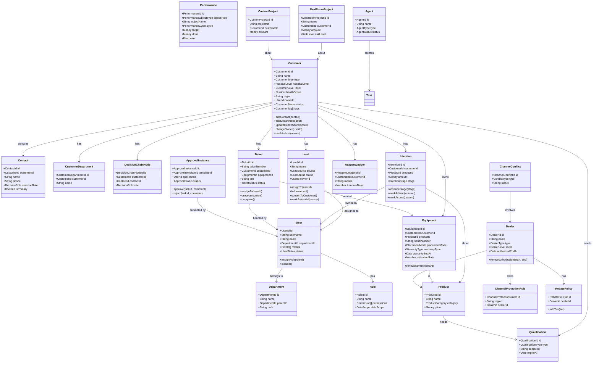

---

## 8. 关键状态机

### 8.1 线索状态机

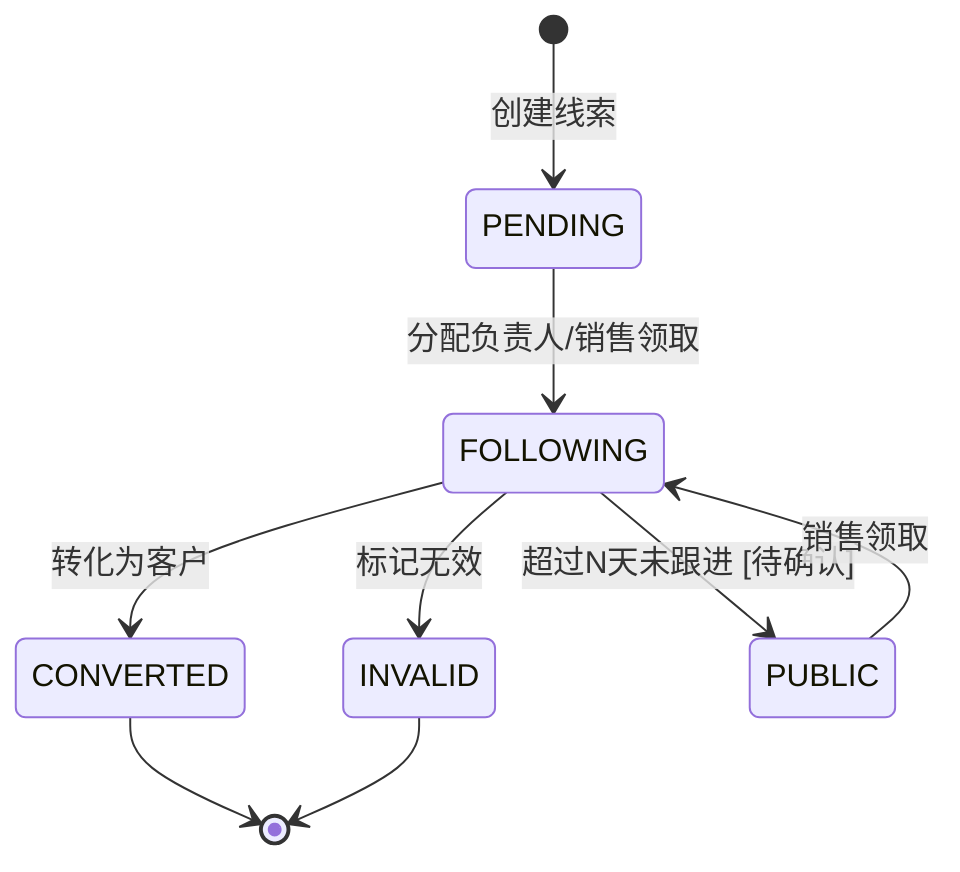

### 8.2 意向状态机

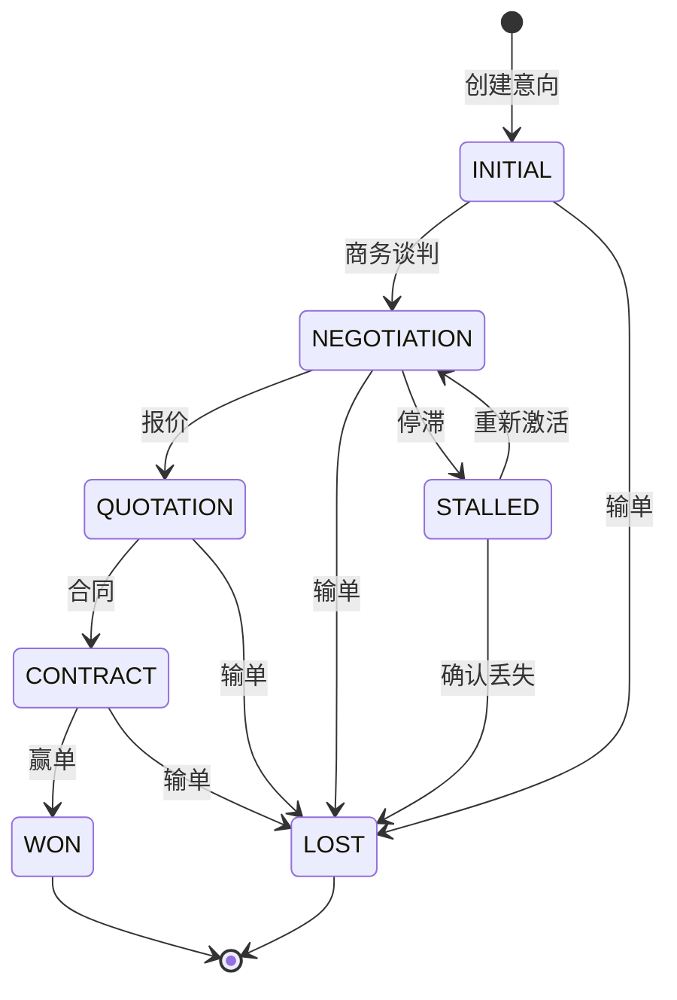

### 8.3 工单状态机

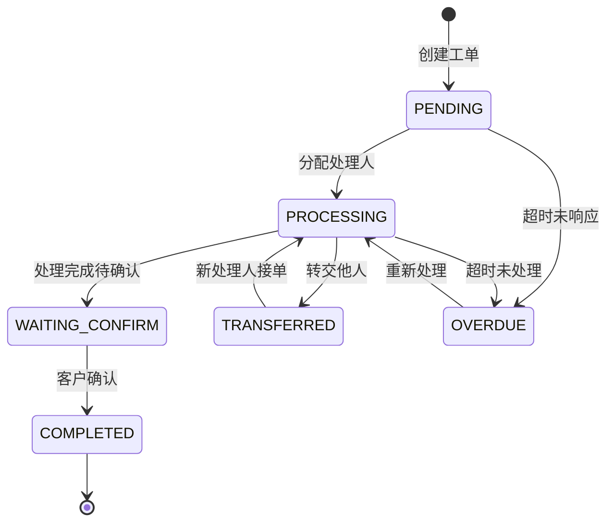

### 8.4 审批状态机

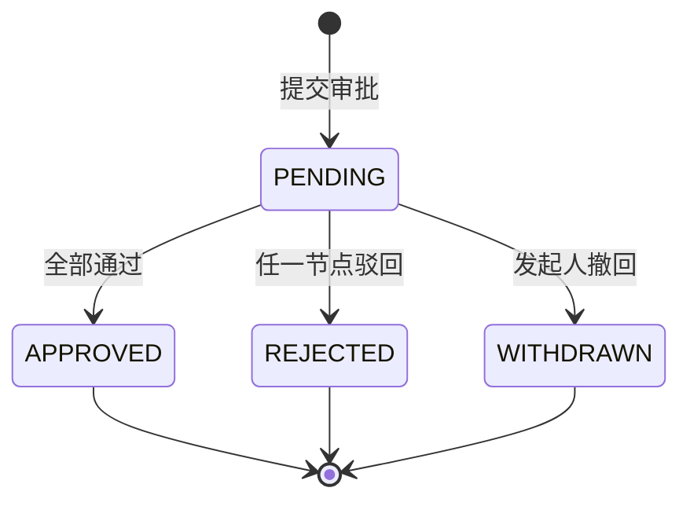

### 8.5 设备状态机

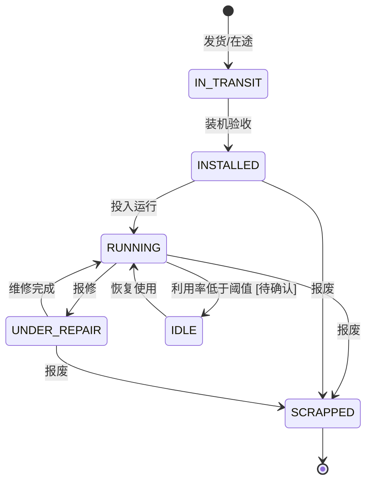

### 8.6 经销商状态机

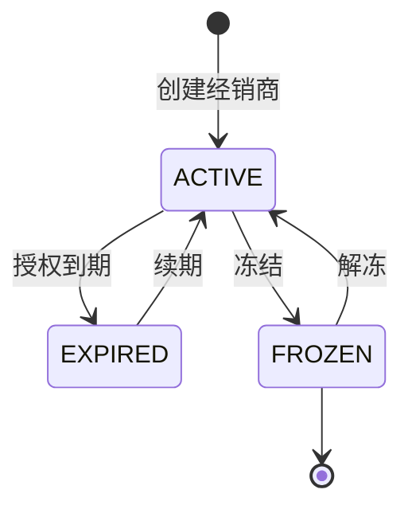

---

## 9. 领域事件流

### 9.1 事件列表

| 事件 | 发布者 | 订阅者 | 触发条件 |
|---|---|---|---|
| UserCreated | 用户与权限 | 消息通知、日志 | 用户创建 |
| UserDisabled | 用户与权限 | 任务管理、消息通知 | 用户禁用 |
| DepartmentChanged | 用户与权限 | 销售域、售后域 | 用户转部门 |
| CustomerCreated | 客户管理 | 消息通知、驾驶舱 | 客户创建 |
| CustomerOwnerChanged | 客户管理 | 任务管理、消息通知 | 客户负责人变更 |
| LeadCreated | 线索管理 | 消息通知 | 线索录入 |
| LeadAssigned | 线索管理 | 消息通知、任务管理 | 线索分配 |
| LeadFollowed | 线索管理 | 消息通知 | 线索跟进 |
| LeadConverted | 线索管理 | 客户管理、绩效域 | 线索转化为客户 |
| LeadReturnedToPublicPool | 线索管理 | 消息通知 | 线索退回公海 |
| IntentionCreated | 意向管理 | 消息通知、驾驶舱 | 意向创建 |
| IntentionStageAdvanced | 意向管理 | 消息通知、驾驶舱 | 意向阶段推进 |
| IntentionWon | 意向管理 | 绩效域、订单域 | 意向赢单 |
| IntentionLost | 意向管理 | 驾驶舱 | 意向输单 |
| EquipmentInstalled | 设备管理 | 售后域、驾驶舱 | 设备安装 |
| EquipmentWarrantyExpiring | 设备管理 | 消息通知、驾驶舱 | 质保即将到期 |
| MaintenanceDue | 设备管理 | 消息通知、任务管理 | 维保到期 |
| TicketCreated | 工单管理 | 消息通知、任务管理 | 工单创建 |
| TicketAssigned | 工单管理 | 消息通知 | 工单分配 |
| TicketOverdue | 工单管理 | 消息通知、驾驶舱 | 工单超时 |
| TicketCompleted | 工单管理 | 绩效域、驾驶舱 | 工单完成 |
| ApprovalTaskAssigned | 审批中心 | 消息通知、任务管理 | 审批任务到达 |
| ApprovalInstanceCompleted | 审批中心 | 业务域、消息通知 | 审批完成 |
| PerformanceGapAlert | 目标绩效 | 消息通知、驾驶舱 | 绩效缺口预警 |
| DealerAuthorizationExpiring | 经销商协同 | 消息通知、驾驶舱 | 授权即将到期 |
| ComplianceAbnormal | 合规风控 | 消息通知、驾驶舱 | 合规异常 |
| QualificationExpiring | 资质管理 | 消息通知、驾驶舱 | 资质即将到期 |
| QualificationRenewed | 资质管理 | 设备/产品/经销商域 | 资质续期完成 |
| ChannelConflictCreated | 渠道秩序 | 消息通知、经销商协同 | 渠道冲突产生 |
| ChannelConflictResolved | 渠道秩序 | 消息通知、经销商协同 | 渠道冲突裁决 |
| RebateSettlementCreated | 返利与佣金 | 消息通知、经销商协同 | 返利结算单生成 |
| RebateSettlementPaid | 返利与佣金 | 消息通知、经销商协同 | 返利发放完成 |
| DealRoomRiskChanged | 大单作战室 | 消息通知、驾驶舱 | 大单风险变化 |
| DealRoomStageAdvanced | 大单作战室 | 消息通知、驾驶舱 | 大单阶段推进 |
| CustomProjectStageCompleted | 定制项目 | 消息通知、驾驶舱 | 定制项目阶段完成 |
| AgentExecuted | AI Agent | 任务管理、消息通知 | Agent 执行结果 |
| BenefitReportGenerated | 效益中心 | 驾驶舱 | 效益报表生成 |
| InsightReportGenerated | 数据洞察 | 驾驶舱 | 洞察报告生成 |
| CustomerHealthScoreChanged | 客户管理 | 消息通知、驾驶舱 | 客户健康度变化 |
| EquipmentUtilizationLow | 设备管理 | 消息通知、驾驶舱 | 设备利用率低 |

### 9.2 典型事件流示例：线索转化

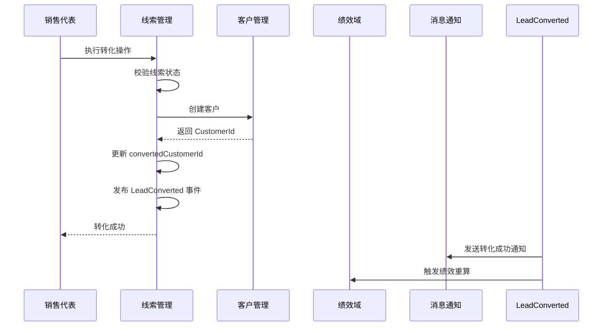

---

## 10. 业务规则

### 10.1 线索管理

- R1：线索超过 N 天未跟进，自动从「我的线索」掉入「公海池」。[待确认：原型显示查重分配机制，具体天数需业务方确认]
- R2：公海池线索可被任意销售领取，领取后变为「我的线索」。
- R3：已转化线索状态锁定，不可再编辑或分配。
- R4：线索来源字典必须包含：官网注册、展会、转介绍、400 电话、代理商推荐、学术活动。
- R5：线索状态包括：待分配、跟进中、已转化、已失效。

### 10.2 客户管理

- R6：一个客户必须有且仅有一个主联系人。
- R7：客户负责人离职或转岗时，客户自动转交其直属上级。
- R8：客户 360° 视图必须聚合客户的基本信息、联系人、科室、决策链、拜访记录、设备、试剂账本、工单、意向、线索。
- R9：客户名称在同一区域内唯一。
- R10：客户类型分为医院类型（综合医院、肿瘤专科、妇幼医院等）和医院等级（三级甲等、三级乙等、二级医院等）两个维度。
- R11：客户等级包括战略客户、普通客户。[待确认：是否还有其他等级]
- R12：客户健康度评分范围为 0-100，低于阈值时触发重点关注。[待确认：具体阈值]

### 10.3 意向管理

- R13：意向金额变化必须记录变更历史。
- R14：停滞超过 N 天的意向必须触发预警通知。[待确认：原型未明确，当前暂用 30 天]
- R15：赢单后的意向可生成销售订单或设备记录。
- R16：意向阶段推进时，赢单概率必须同步更新。

### 10.4 工单管理

- R17：工单类型包括：安装、维修、保养、巡检。
- R18：工单优先级包括：紧急、高、中、低。
- R19：高优先级工单必须在 N 小时内响应。[待确认：原型未明确，当前暂用 2 小时]
- R20：工单超时自动升级并通知处理人主管。
- R21：工单完成后需客户确认，否则 N 天后自动完成。[待确认：原型未明确，当前暂用 3 天]
- R22：同一设备 N 天内重复报修 M 次以上，自动触发质量预警。[待确认]

### 10.5 设备与维保

- R23：设备状态包括：在途、已装机、运行中、维修中、闲置、报废。
- R24：设备投放模式包括：销售、TP、捐赠、租赁。
- R25：设备维保类型包括：原厂质保、延保、第三方维保、无。
- R26：设备利用率低于 N% 时标记为闲置。[待确认：原型显示 20%]
- R27：设备质保到期前 N 天触发预警。[待确认：原型未明确，当前暂用 30 天]
- R28：维保计划到期前 N 天自动生成维保任务。[待确认：原型未明确，当前暂用 7 天]
- R29：设备报废后，关联工单必须完结。

### 10.6 经销商

- R30：经销商等级包括 A、B、C、D 四级。
- R31：经销商授权到期前 N 天触发预警。[待确认：原型未明确，当前暂用 30 天]
- R32：经销商冻结后，其名下客户由区域经理接管。
- R33：经销商返利按季度结算，结算前必须完成对账。
- R34：渠道库存周转天数纳入渠道绩效指标。
- R35：返利结算准确率纳入经销商协同指标。

### 10.7 审批

- R36：审批发起人不能审批自己的申请。
- R37：审批被驳回后，发起人可修改后重新提交。
- R38：审批转交后，原审批人不再可见该任务。

### 10.8 绩效

- R39：绩效数据按周期定时聚合，不允许实时全量计算。
- R40：团队/区域绩效需按组织架构层级汇总。
- R41：渠道绩效需包含销售额、返利达标率、库存周转等指标。
- R42：个人绩效仅统计本人负责的业务数据。

### 10.9 渠道秩序

- R43：经销商授权区域外销售视为越区出货。
- R44：多个经销商同时报备同一客户视为撞单。
- R45：渠道冲突需提交裁决，裁决结果对参与方生效。

### 10.10 返利与佣金

- R46：返利政策支持阶梯返利规则。
- R47：返利结算周期为季度。[待确认：是否也支持月度/年度]
- R48：返利结算前必须完成对账。
- R49：佣金可按销售、回款、装机等维度计算。

### 10.11 资质管理

- R50：资质类型包括产品注册证、经销商资质、客户资质等。
- R51：资质到期前 N 天触发预警。[待确认]
- R52：资质续期后更新有效期并保留历史版本。

### 10.12 大单作战室

- R53：大单定义为预计金额超过 100 万的项目。
- R54：大单风险等级包括高、中、低。
- R55：大单阶段包括需求确认、招标中、谈判中、合同签订、交付中。[待确认：是否与意向阶段统一]

### 10.13 数据权限

- R56：用户只能看到自己有权限的数据范围（本人/本部门/本区域/全部）。
- R57：超管可以查看全部数据，但操作日志必须记录。
- R58：数据权限变更后，历史数据可见性不追溯变更。

---

## 11. 领域服务与应用服务

### 11.1 领域服务（Domain Service）

领域服务处理不适合放在聚合内的跨聚合业务逻辑。

#### LeadAssignmentService（线索分配服务）

```typescript
class LeadAssignmentService {
  assignLead(leadId: LeadId, userId: UserId): void {
    const lead = leadRepository.findById(leadId)
    const user = userRepository.findById(userId)
    
    // 校验线索状态：只有待分配或公海池线索可分配
    if (lead.status !== LeadStatus.PENDING && lead.poolType !== PoolType.PUBLIC) {
      throw new DomainException('线索不可分配')
    }
    
    // 校验用户接收上限 [待确认：具体上限需业务方确认]
    // if (leadRepository.countByOwner(userId) >= N) {
    //   throw new DomainException('该用户跟进线索已达上限')
    // }
    
    lead.assignTo(userId)
    leadRepository.save(lead)
    eventBus.publish(new LeadAssigned(leadId, userId))
  }
}
```

#### CustomerTransferService（客户转移服务）

```typescript
class CustomerTransferService {
  transferCustomer(customerId: CustomerId, toUserId: UserId): void {
    const customer = customerRepository.findById(customerId)
    const toUser = userRepository.findById(toUserId)
    
    // 校验接收人权限
    if (!this.canReceiveCustomer(toUser, customer)) {
      throw new DomainException('接收人无权限接收该客户')
    }
    
    const fromUserId = customer.ownerId
    customer.changeOwner(toUserId)
    customerRepository.save(customer)
    
    // 可选：同时转移关联线索和意向
    this.transferRelatedLeads(customerId, toUserId)
    this.transferRelatedIntentions(customerId, toUserId)
    
    eventBus.publish(new CustomerOwnerChanged(customerId, fromUserId, toUserId))
  }
}
```

#### PerformanceAggregationService（绩效聚合服务）

```typescript
class PerformanceAggregationService {
  async calculatePerformance(cycle: string, objectType: PerformanceObjectType): Promise<void> {
    // 根据维度获取原始数据
    const rawData = await this.getRawData(objectType, cycle)
    
    // 计算目标、完成、达成率、缺口、同比
    const performances = rawData.map(data => {
      const target = data.target
      const done = data.done
      const rate = target > 0 ? done / target : 0
      const gap = target - done
      const yoy = this.calculateYoY(data.objectId, cycle)
      
      return new Performance({
        objectType,
        objectId: data.objectId,
        objectName: data.objectName,
        cycle,
        target,
        done,
        rate,
        gap,
        yoy
      })
    })
    
    await performanceRepository.batchSave(performances)
    eventBus.publish(new PerformanceCalculated(cycle, objectType))
  }
}
```

#### DataScopeService（数据权限服务）

```typescript
class DataScopeService {
  applyDataScope<T>(query: Query<T>, userId: UserId): Query<T> {
    const user = userRepository.findById(userId)
    const dataScope = this.getMaxDataScope(user)
    
    switch (dataScope) {
      case DataScope.SELF:
        return query.where('ownerId', userId)
      case DataScope.DEPT:
        return query.whereIn('ownerId', this.getDeptUserIds(user.departmentId))
      case DataScope.DEPT_AND_CHILD:
        return query.whereIn('ownerId', this.getDeptAndChildUserIds(user.departmentId))
      case DataScope.REGION:
        return query.where('region', user.region)
      case DataScope.ALL:
      default:
        return query
    }
  }
}
```

#### ChannelConflictService（渠道冲突裁决服务）

```typescript
class ChannelConflictService {
  submitConflict(conflict: ChannelConflict): void {
    if (conflict.type === ConflictType.DUPLICATE_ORDER) {
      this.validateDuplicateOrder(conflict)
    } else if (conflict.type === ConflictType.CROSS_REGION_SHIPMENT) {
      this.validateCrossRegionShipment(conflict)
    }

    conflict.submit()
    channelConflictRepository.save(conflict)
    eventBus.publish(new ChannelConflictCreated(conflict.id))
  }

  ruleConflict(conflictId: ChannelConflictId, result: string, operatorId: UserId): void {
    const conflict = channelConflictRepository.findById(conflictId)
    conflict.rule(result)
    channelConflictRepository.save(conflict)
    eventBus.publish(new ChannelConflictResolved(conflict.id, result))
  }
}
```

#### RebateCalculationService（返利计算服务）

```typescript
class RebateCalculationService {
  async calculateRebate(dealerId: DealerId, cycle: string): Promise<RebateSettlement> {
    const dealer = dealerRepository.findById(dealerId)
    const salesAmount = await salesRepository.getDealerSalesAmount(dealerId, cycle)
    const policy = rebatePolicyRepository.findEffectivePolicy(dealerId, cycle)

    const rebateRate = this.calculateRebateRate(salesAmount, policy.tiers)
    const rebateAmount = salesAmount * rebateRate

    const settlement = new RebateSettlement({
      dealerId,
      cycle,
      salesAmount,
      rebateRate,
      rebateAmount,
      status: SettlementStatus.PENDING_RECONCILIATION
    })

    rebateSettlementRepository.save(settlement)
    eventBus.publish(new RebateSettlementCreated(settlement.id))
    return settlement
  }
}
```

#### QualificationExpiryCheckService（资质到期检查服务）

```typescript
class QualificationExpiryCheckService {
  async checkExpiringQualifications(): Promise<void> {
    const expiringDays = 30 // [待确认]
    const qualifications = qualificationRepository.findExpiring(expiringDays)

    for (const qualification of qualifications) {
      qualification.markAsExpiring()
      qualificationRepository.save(qualification)
      eventBus.publish(new QualificationExpiring(qualification.id))
    }
  }
}
```

#### CustomerHealthScoreService（客户健康度计算服务）

```typescript
class CustomerHealthScoreService {
  async calculateHealthScore(customerId: CustomerId): Promise<number> {
    const customer = customerRepository.findById(customerId)

    const visitScore = this.calculateVisitScore(customerId)
    const interactionScore = this.calculateInteractionScore(customerId)
    const equipmentScore = this.calculateEquipmentScore(customerId)
    const ticketScore = this.calculateTicketScore(customerId)
    const intentionScore = this.calculateIntentionScore(customerId)

    const totalScore = this.weightedSum([
      visitScore, interactionScore, equipmentScore, ticketScore, intentionScore
    ])

    customer.updateHealthScore(Math.round(totalScore))
    customerRepository.save(customer)
    eventBus.publish(new CustomerHealthScoreChanged(customerId, totalScore))
    return totalScore
  }
}
```

#### DealRoomRiskService（大单风险服务）

```typescript
class DealRoomRiskService {
  evaluateRisk(projectId: DealRoomProjectId): RiskLevel {
    const project = dealRoomProjectRepository.findById(projectId)
    const risks = dealRoomRiskRepository.findByProjectId(projectId)

    if (risks.some(r => r.level === RiskLevel.HIGH)) {
      return RiskLevel.HIGH
    }
    if (risks.some(r => r.level === RiskLevel.MEDIUM)) {
      return RiskLevel.MEDIUM
    }
    return RiskLevel.LOW
  }
}
```

### 11.2 应用服务（Application Service）

应用服务负责编排领域对象，处理用例流程，不包含业务规则。

#### LeadApplicationService

```typescript
class LeadApplicationService {
  constructor(
    private leadService: LeadAssignmentService,
    private leadRepository: LeadRepository,
    private eventBus: EventBus
  ) {}

  async createLead(dto: CreateLeadDto): Promise<LeadId> {
    const lead = Lead.create(dto)
    await this.leadRepository.save(lead)
    this.eventBus.publish(new LeadCreated(lead.id))
    return lead.id
  }

  async assignLead(leadId: LeadId, userId: UserId): Promise<void> {
    await this.leadService.assignLead(leadId, userId)
  }

  async convertLead(leadId: LeadId, dto: ConvertLeadDto): Promise<CustomerId> {
    const lead = await this.leadRepository.findById(leadId)
    const customer = Customer.create(dto.customer)
    lead.convertToCustomer(customer.id)
    await this.leadRepository.save(lead)
    this.eventBus.publish(new LeadConverted(leadId, customer.id))
    return customer.id
  }
}
```

---

## 12. 数据权限模型

### 12.1 权限维度

XQCOP 的权限控制分为三个维度：

| 维度 | 控制内容 | 实现位置 |
|---|---|---|
| 功能权限 | 菜单、按钮、API 是否可见/可调用 | RBAC Role + Permission |
| 数据权限 | 能看到哪些数据 | DataScopeService |
| 字段权限 | 某些敏感字段是否可见 | DTO + 字段级注解 |

### 12.2 RBAC 模型

```
User --N:M--> Role --N:M--> Permission
Permission = { resource, action }
```

### 12.3 数据权限范围

| 范围 | 说明 | 适用角色 |
|---|---|---|
| SELF | 仅本人创建或负责的数据 | 销售代表 |
| DEPT | 本部门内所有数据 | 部门主管 |
| DEPT_AND_CHILD | 本部门及所有下级部门数据 | 区域经理 |
| REGION | 用户所属区域的数据 | 区域总监 |
| ALL | 全部数据 | 超管、高管 |

### 12.4 权限计算流程

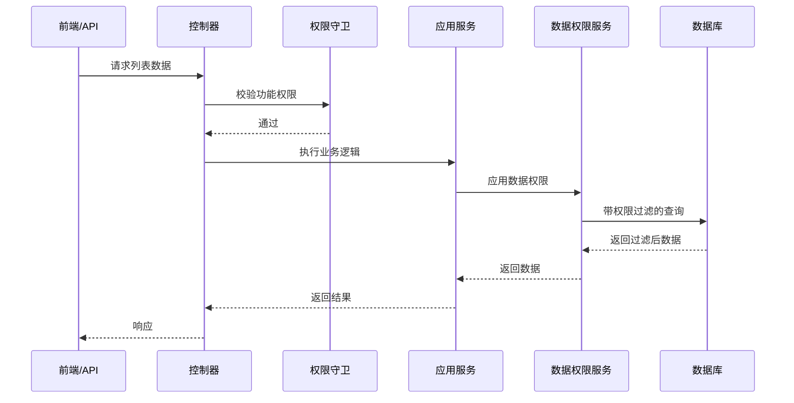

---

## 13. 领域模型到数据库的映射

### 13.1 映射规则

| 领域概念 | 数据库表现 |
|---|---|
| 聚合根 | 主表，独立主键 |
| 聚合内实体 | 从表，外键指向聚合根 |
| 值对象 | 字段，或 JSONB 列 |
| 枚举 | 字典表或数据库枚举类型 |
| 多对多关系 | 关联表 |
| 领域事件 | 事件表 + 消息队列 |
| 大字段/文件 | 对象存储，数据库保存 key |

### 13.2 示例：Customer 聚合映射

**Prisma Schema：**

```prisma
model Customer {
  id            String   @id @default(cuid())
  name          String
  type          String   // 医院类型：综合医院 / 肿瘤专科 / 妇幼医院等
  hospitalLevel String   // 医院等级：三级甲等 / 三级乙等 / 二级医院等
  level         String   // 客户等级：战略客户 / 普通客户
  healthScore   Int?     // 关系健康度 0-100
  region        String
  address       Json?
  ownerId       String
  status        String
  tags          String[]
  source        String
  createdAt     DateTime @default(now())
  updatedAt     DateTime @updatedAt

  contacts          Contact[]
  departments       CustomerDepartment[]
  decisionChains    DecisionChainNode[]
  visitRecords      VisitRecord[]
  leads             Lead[]
  intentions        Intention[]
  equipments        Equipment[]
  reagentLedgers    ReagentLedger[]
  tickets           Ticket[]
  qualifications    Qualification[]

  @@index([ownerId])
  @@index([region])
  @@index([status])
  @@index([type])
  @@index([level])
}

model Contact {
  id            String  @id @default(cuid())
  customerId    String
  name          String
  phone         String
  email         String?
  position      String?
  departmentId  String?
  decisionRole  String   // 决策人 / 影响人 / 使用人 / 把关人
  isPrimary     Boolean @default(false)
  status        String  @default("ACTIVE")
  createdAt     DateTime @default(now())

  customer   Customer           @relation(fields: [customerId], references: [id], onDelete: Cascade)
  department CustomerDepartment? @relation(fields: [departmentId], references: [id])

  @@index([customerId])
}

model CustomerDepartment {
  id         String  @id @default(cuid())
  customerId String
  name       String
  bedCount   Int?
  remark     String?
  createdAt  DateTime @default(now())

  customer Customer @relation(fields: [customerId], references: [id], onDelete: Cascade)
  contacts Contact[]

  @@index([customerId])
}

model DecisionChainNode {
  id             String  @id @default(cuid())
  customerId     String
  contactId      String
  role           String
  influenceLevel Int
  decisionArea   String?
  createdAt      DateTime @default(now())

  customer Customer @relation(fields: [customerId], references: [id], onDelete: Cascade)

  @@index([customerId])
}

model VisitRecord {
  id          String   @id @default(cuid())
  customerId  String
  visitorId   String
  visitType   String
  visitTime   DateTime
  content     String
  location    String?
  attachments Json?
  createdAt   DateTime @default(now())

  customer Customer @relation(fields: [customerId], references: [id], onDelete: Cascade)

  @@index([customerId])
  @@index([visitTime])
}
```

---

## 14. 与外部系统的集成

### 14.1 企业微信/钉钉

| 集成点 | 方向 | 说明 |
|---|---|---|
| 组织架构同步 | 外部 → XQCOP | 定时同步部门/用户 |
| 消息推送 | XQCOP → 外部 | 审批、任务、预警通知 |
| 单点登录 | 双向 | 企业微信扫码登录 |

### 14.2 短信平台

| 集成点 | 方向 | 说明 |
|---|---|---|
| 验证码 | XQCOP → 外部 | 登录、修改密码 |
| 预警短信 | XQCOP → 外部 | 工单超时、维保到期 |

### 14.3 邮件系统

| 集成点 | 方向 | 说明 |
|---|---|---|
| 邮件通知 | XQCOP → 外部 | 日报、周报、审批提醒 |

### 14.4 ERP/财务系统（未来）

| 集成点 | 方向 | 说明 |
|---|---|---|
| 订单同步 | 外部 → XQCOP | 销售订单数据 |
| 回款同步 | 外部 → XQCOP | 回款数据用于绩效计算 |
| 发票信息 | 外部 → XQCOP | 客户开票信息 |

### 14.5 AI 大模型服务

| 集成点 | 方向 | 说明 |
|---|---|---|
| AI 问数 | XQCOP → 外部 | 自然语言查询经营数据 |
| Agent 执行 | XQCOP → 外部 | 调用大模型完成 Agent 任务 |
| 分析结论生成 | XQCOP → 外部 | 驾驶舱、洞察报告 AI 分析结论 |

### 14.6 国家药监局/资质数据库

| 集成点 | 方向 | 说明 |
|---|---|---|
| 产品注册证校验 | 外部 → XQCOP | 验证产品注册证真伪和有效期 |
| 资质信息同步 | 外部 → XQCOP | 自动同步资质到期信息 |

---

## 15. 落地实施建议

### 15.1 建模工作坊

建议组织一次 1 天的领域建模工作坊：

| 时间段 | 内容 | 产出 |
|---|---|---|
| 09:00-10:00 | 统一语言梳理 | 术语表 v1.0 |
| 10:00-12:00 | 事件风暴：销售域 | 销售域事件流、聚合根 |
| 13:00-15:00 | 事件风暴：售后域 + 渠道域 | 售后/渠道域事件流、聚合根 |
| 15:00-16:30 | 状态机与业务规则 | 关键状态机、规则清单 |
| 16:30-17:30 | 确定首期开发范围 | P0/P1 优先级清单 |

参与人员：产品经理 1 人、业务专家 1-2 人、后端架构师 1 人、前端负责人 1 人、测试负责人 1 人。

### 15.2 首期聚焦范围

建议首期只聚焦以下核心上下文：

1. 用户与权限
2. 客户管理（含科室、决策链、健康度）
3. 线索管理
4. 意向管理
5. 产品品牌
6. 资质管理（产品注册证至少）

P1 阶段扩展：设备、工单、经销商、渠道秩序、返利与佣金、审批、任务、绩效。
P2 阶段扩展：AI Agent、效益中心、数据洞察、大单作战室、定制项目。

### 15.3 模型演进原则

- 每个上下文独立演进，不跨上下文直接操作数据。
- 上下文之间通过领域事件或应用服务 API 通信。
- 聚合根变更必须同步更新数据库迁移脚本、API 契约、前端类型。
- 业务规则变更必须有测试用例覆盖。

### 15.4 验收标准

- 术语表经过业务方确认。
- 核心状态机覆盖所有业务分支。
- 每个聚合根都有对应的 Repository 和单元测试。
- 领域事件有发布者和订阅者测试。
- 数据权限规则在所有列表查询中生效。

---

## 16. 版本记录

| 版本 | 日期 | 作者 | 变更说明 |
|---|---|---|---|
| v1.0 | - | - | 初始版本，建立 XQCOP 完整领域模型 |
| v1.1 | - | - | 基于原型扫描结果对齐：新增 AI Agent、资质管理、效益中心、数据洞察、大单作战室、定制项目、渠道秩序、返利与佣金 8 个限界上下文；修正线索/设备/工单枚举和字段；补充客户 360° 科室、决策链、健康度；业务规则标注 [待确认] 项 |

---

> 本文档是 XQCOP 系统设计的底层依据。后续所有数据库设计、API 设计、前端开发、测试用例都应以本文档为准。遇到业务理解分歧时，以本文档中的统一语言和业务规则为最终依据。
