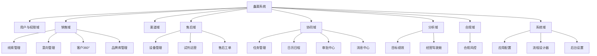
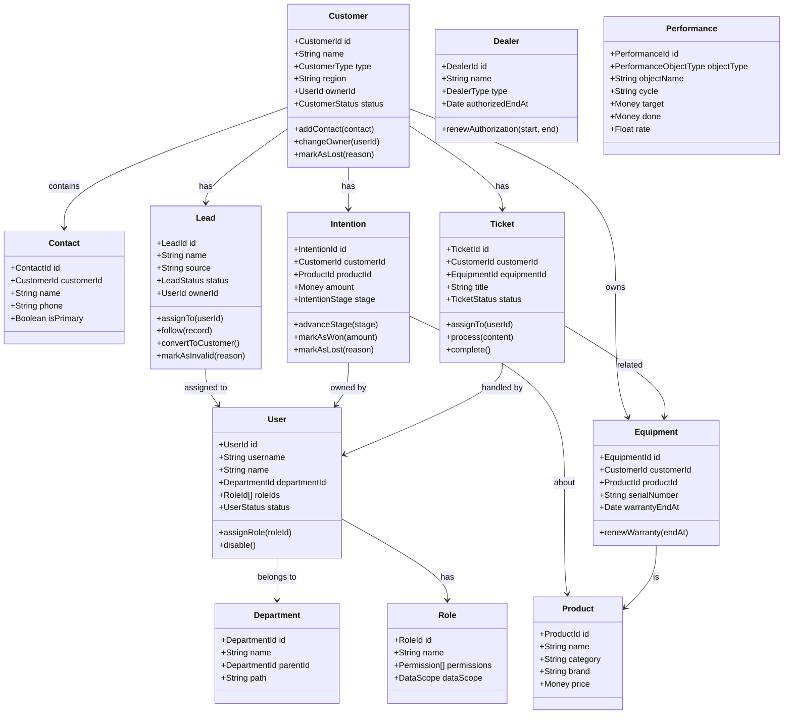
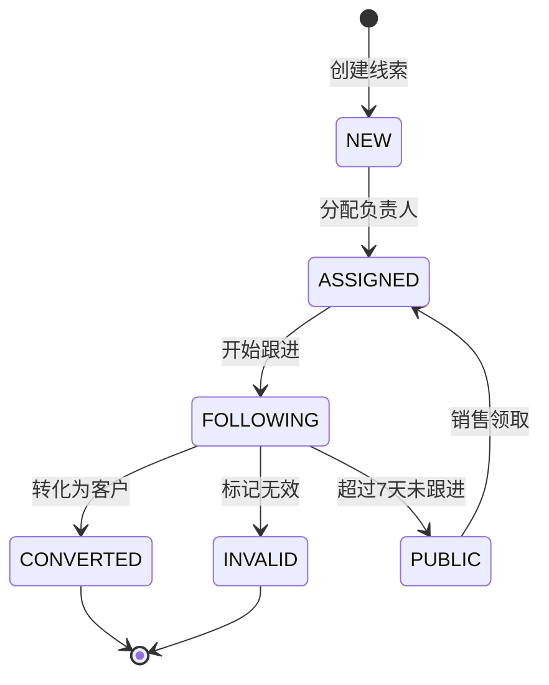
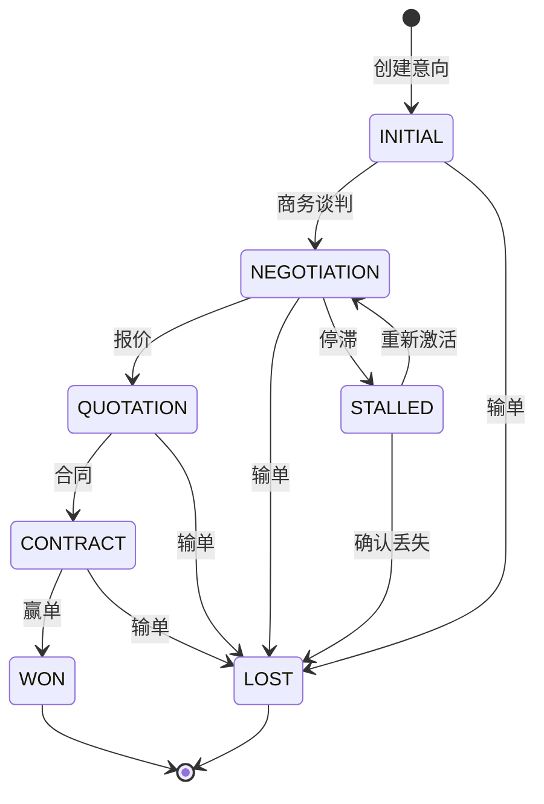
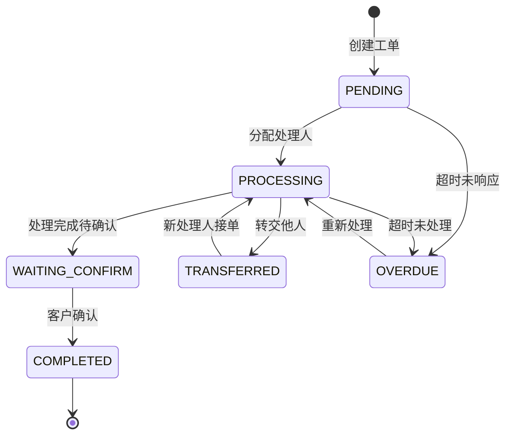
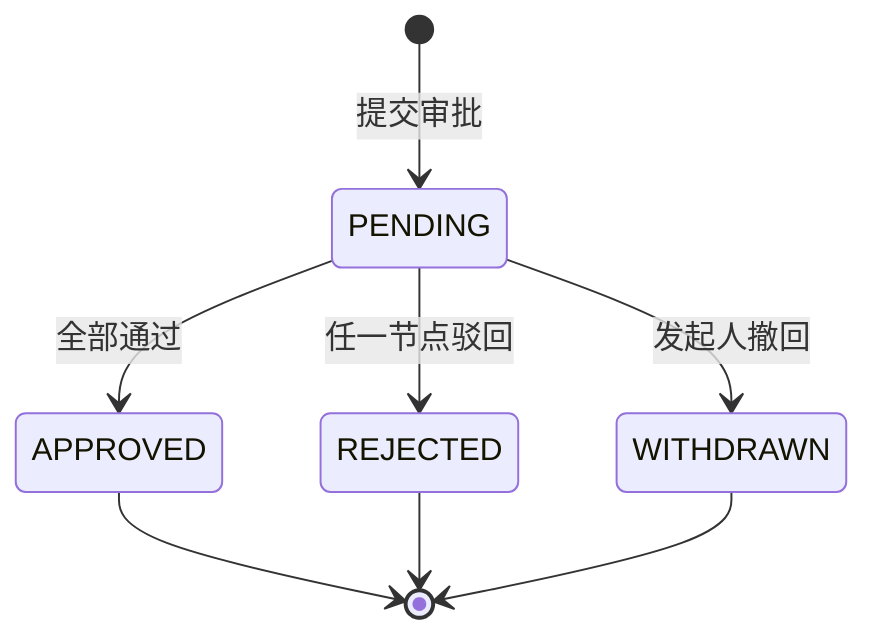

# 鑫渠系统领域建模方案

> 本方案基于高保真原型与业务需求，采用领域驱动设计（DDD）方法，对鑫渠 CRM/业务协同系统进行领域建模。
>
> 目标：统一业务语言、明确聚合边界、梳理状态流转、沉淀业务规则，为后端数据库设计与前端交互开发提供底层依据。

---

## 1. 建模方法与原则

### 1.1 采用的方法

- **事件风暴（Event Storming）**：用于梳理核心业务流程，识别聚合根与领域事件。
- **名词动词分析法**：从原型与需求描述中提取候选实体与行为。
- **四色原型法**：区分 MI（时刻-时段）、Role（角色）、Description（描述）、PPT（参与方-地点-物品）。
- **用例驱动法**：从系统功能反推所需实体与关系。

### 1.2 建模原则

- **统一语言（Ubiquitous Language）**：术语表中定义的词汇必须在产品、开发、测试、业务方之间统一。
- **聚合边界清晰**：每个聚合根独立负责自身一致性，外部通过聚合根 ID 引用。
- **行为显式化**：业务规则、状态流转、领域事件必须显式表达，不隐藏在 SQL 或 UI 逻辑中。
- **领域模型优先于数据库模型**：先有领域模型，再推导 ER 图与表结构。

---

## 2. 统一语言（术语表）

| 术语 | 英文 | 定义 | 所属子域 |
|---|---|---|---|
| 用户 | User | 系统的登录账号，可关联一个或多个角色 | 用户与权限域 |
| 角色 | Role | 权限集合，如销售代表、区域经理、售后工程师 | 用户与权限域 |
| 部门 | Department | 组织架构单元，支持树形层级 | 用户与权限域 |
| 客户 | Customer | 购买或使用产品的机构，如医院、第三方检验中心 | 销售域 |
| 联系人 | Contact | 客户机构内的具体对接人 | 销售域 |
| 线索 | Lead | 尚未确认合作意向的潜在客户信息 | 销售域 |
| 意向 | Intention | 客户对某产品/服务的明确采购意向 | 销售域 |
| 品牌/产品 | Product | 销售的产品或品牌，如希森美康血球、生化产品线 | 销售域 |
| 经销商 | Dealer | 代理销售产品的渠道商 | 渠道域 |
| 设备 | Equipment | 已售出的仪器/设备，绑定客户与质保信息 | 售后域 |
| 试剂 | Reagent | 与设备配套使用的耗材/试剂 | 售后域 |
| 工单 | Ticket | 售后服务请求或问题处理单 | 售后域 |
| 任务 | Task | 销售/售后人员的待办事项 | 协同域 |
| 日程 | Schedule | 日历上的预约、拜访、会议 | 协同域 |
| 审批实例 | ApprovalInstance | 一次具体的审批流程 | 协同域 |
| 审批任务 | ApprovalTask | 审批实例中某个节点的待办 | 协同域 |
| 绩效 | Performance | 某对象在特定周期内的目标与达成情况 | 分析域 |
| 合规记录 | ComplianceRecord | 拜访、活动、样品、飞检等合规证据 | 合规域 |
| 消息 | Message | 系统通知、审批提醒、预警推送 | 协同域 |
| 应用 | App | 应用中心中的功能模块入口 | 系统域 |
| 字典 | Dictionary | 可配置的基础数据分类，如线索来源、工单类型 | 系统域 |

---

## 3. 子域划分（Subdomain）



### 3.1 子域优先级

| 优先级 | 子域 | 理由 |
|---|---|---|
| P0 | 用户与权限域 | 所有模块基础 |
| P0 | 销售域（线索、意向、客户） | 业务主线，数据量最大 |
| P1 | 渠道域（经销商） | 与销售域强关联 |
| P1 | 售后域（设备、试剂、工单） | 售后闭环 |
| P2 | 协同域（任务、日历、审批、消息） | 流程支撑 |
| P2 | 分析域（绩效、驾驶舱） | 依赖其他域数据聚合 |
| P2 | 合规域 | 强监管要求 |
| P3 | 系统域 | 平台化能力 |

---

## 4. 核心聚合与实体

### 4.1 用户与权限域

#### 聚合根：User（用户）

```
User
├── id: UserId
├── username: string
├── name: string
├── phone: string
├── email: string
├── departmentId: DepartmentId
├── roleIds: RoleId[]
├── status: ACTIVE | INACTIVE
├── createdAt: DateTime
└── updatedAt: DateTime
```

**行为：**
- `assignRole(roleId)`：分配角色
- `transferDepartment(deptId)`：转部门
- `disable()`：禁用账号

#### 聚合根：Department（部门）

```
Department
├── id: DepartmentId
├── name: string
├── parentId: DepartmentId?
├── leaderId: UserId?
└── path: string
```

#### 聚合根：Role（角色）

```
Role
├── id: RoleId
├── name: string
├── permissions: Permission[]
└── dataScope: SELF | DEPT | DEPT_AND_CHILD | REGION | ALL
```

**值对象：**
- `Permission`：{ resource, action }
- `DataScope`：数据权限范围

---

### 4.2 销售域

#### 聚合根：Customer（客户）

```
Customer
├── id: CustomerId
├── name: string
├── type: HOSPITAL | LAB | DEALER | OTHER
├── region: string
├── address: Address?
├── ownerId: UserId
├── status: POTENTIAL | COOPERATING | LOST
├── tags: string[]
├── source: string
├── createdAt: DateTime
├── updatedAt: DateTime
├── contacts: Contact[]
├── visitRecords: VisitRecord[]
├── intentions: Intention[]
├── equipments: Equipment[]
└── tickets: Ticket[]
```

**行为：**
- `addContact(contact)`：添加联系人
- `removeContact(contactId)`：移除联系人
- `changeOwner(userId)`：变更负责人
- `markAsLost(reason)`：标记流失
- `addTag(tag)`：添加标签

**领域事件：**
- `CustomerCreated`
- `CustomerOwnerChanged`
- `CustomerMarkedAsLost`

#### 实体：Contact（联系人）

```
Contact
├── id: ContactId
├── customerId: CustomerId
├── name: string
├── phone: string
├── email: string?
├── position: string?
├── isPrimary: boolean
└── status: ACTIVE | INACTIVE
```

> Contact 是 Customer 聚合内的实体，不能独立存在。

#### 实体：VisitRecord（拜访记录）

```
VisitRecord
├── id: VisitRecordId
├── customerId: CustomerId
├── visitorId: UserId
├── visitType: string
├── visitTime: DateTime
├── content: string
├── location: string?
├── attachments: Attachment[]
└── createdAt: DateTime
```

#### 聚合根：Lead（线索）

```
Lead
├── id: LeadId
├── name: string
├── source: string
├── sourceDetail: string?
├── status: LeadStatus
├── poolType: MINE | PUBLIC | TEAM
├── ownerId: UserId?
├── region: string?
├── contactName: string?
├── contactPhone: string?
├── companyName: string?
├── intentionLevel: HIGH | MEDIUM | LOW
├── followCount: number
├── lastFollowAt: DateTime?
├── convertedCustomerId: CustomerId?
├── createdAt: DateTime
├── updatedAt: DateTime
└── followRecords: LeadFollowRecord[]
```

**状态机：**

```
NEW → ASSIGNED → FOLLOWING → CONVERTED
                    ↓
                 INVALID
```

**行为：**
- `assignTo(userId)`：分配负责人
- `follow(record)`：跟进
- `convertToCustomer()`：转化为客户
- `markAsInvalid(reason)`：标记无效
- `returnToPublicPool()`：退回公海池

**领域事件：**
- `LeadCreated`
- `LeadAssigned`
- `LeadFollowed`
- `LeadConverted`
- `LeadReturnedToPublicPool`

**业务规则：**
- 线索超过 7 天未跟进，自动掉入公海池。
- 公海池线索可被任意销售领取。
- 已转化线索不可再编辑。

#### 实体：LeadFollowRecord（线索跟进记录）

```
LeadFollowRecord
├── id: LeadFollowRecordId
├── leadId: LeadId
├── followerId: UserId
├── followType: PHONE | VISIT | WECHAT | EMAIL
├── content: string
├── nextFollowAt: DateTime?
├── createdAt: DateTime
```

#### 聚合根：Intention（意向）

```
Intention
├── id: IntentionId
├── customerId: CustomerId
├── productId: ProductId
├── amount: Money?
├── stage: IntentionStage
├── probability: number
├── expectedAt: DateTime?
├── ownerId: UserId
├── status: ACTIVE | WON | LOST | STALLED
├── createdAt: DateTime
├── updatedAt: DateTime
└── stageRecords: IntentionStageRecord[]
```

**状态机：**

```
INITIAL → NEGOTIATION → QUOTATION → CONTRACT → WON
    ↓
  LOST / STALLED
```

**行为：**
- `advanceStage(newStage, probability)`：推进阶段
- `markAsWon(actualAmount)`：赢单
- `markAsLost(reason)`：输单
- `markAsStalled(reason)`：停滞
- `assignTo(userId)`：变更负责人

**业务规则：**
- 意向金额变化必须记录变更日志。
- 停滞超过 30 天未跟进，自动预警。
- 赢单后可生成订单或设备记录。

#### 实体：IntentionStageRecord（意向阶段记录）

```
IntentionStageRecord
├── id: IntentionStageRecordId
├── intentionId: IntentionId
├── fromStage: IntentionStage
├── toStage: IntentionStage
├── probability: number
├── operatorId: UserId
├── remark: string?
└── createdAt: DateTime
```

#### 聚合根：Product（产品/品牌）

```
Product
├── id: ProductId
├── name: string
├── code: string
├── category: string
├── brand: string
├── unit: string
├── price: Money?
├── status: ACTIVE | INACTIVE
├── createdAt: DateTime
└── updatedAt: DateTime
```

**值对象：**
- `Money`：{ amount, currency }
- `Address`：{ province, city, district, detail }

---

### 4.3 渠道域

#### 聚合根：Dealer（经销商）

```
Dealer
├── id: DealerId
├── name: string
├── type: CORE | GENERAL
├── region: string
├── authorizedStartAt: DateTime
├── authorizedEndAt: DateTime
├── creditLevel: string
├── contactName: string
├── contactPhone: string
├── ownerId: UserId
├── status: ACTIVE | EXPIRED | FROZEN
├── createdAt: DateTime
└── updatedAt: DateTime
```

**行为：**
- `renewAuthorization(start, end)`：续期授权
- `freeze()`：冻结
- `unfreeze()`：解冻
- `changeLevel(level)`：调整信用等级

**领域事件：**
- `DealerAuthorizationExpiring`（授权即将到期预警）
- `DealerFrozen`

---

### 4.4 售后域

#### 聚合根：Equipment（设备）

```
Equipment
├── id: EquipmentId
├── customerId: CustomerId
├── productId: ProductId
├── serialNumber: string
├── installAt: DateTime?
├── warrantyStartAt: DateTime
├── warrantyEndAt: DateTime
├── status: NORMAL | MAINTENANCE | SCRAPPED
├── location: string?
├── createdAt: DateTime
└── updatedAt: DateTime
```

**行为：**
- `renewWarranty(endAt)`：延保
- `requestMaintenance()`：发起维保
- `scrap(reason)`：报废

**领域事件：**
- `EquipmentWarrantyExpiring`
- `EquipmentMaintenanceDue`

#### 聚合根：Ticket（工单）

```
Ticket
├── id: TicketId
├── customerId: CustomerId
├── equipmentId: EquipmentId?
├── type: string
├── priority: URGENT | HIGH | NORMAL | LOW
├── status: TicketStatus
├── title: string
├── description: string
├── reporterId: UserId
├── ownerId: UserId?
├── attachments: Attachment[]
├── createdAt: DateTime
├── updatedAt: DateTime
└── processRecords: TicketProcessRecord[]
```

**状态机：**

```
PENDING → PROCESSING → WAITING_CONFIRM → COMPLETED
    ↓
 TRANSFERRED / OVERDUE
```

**行为：**
- `assignTo(userId)`：分配处理人
- `process(content, attachments)`：处理
- `transfer(userId, reason)`：转交
- `complete()`：完成
- `markAsOverdue()`：标记超时

**业务规则：**
- 高优先级工单 2 小时内必须响应。
- 工单超时自动升级并通知主管。
- 完成后需客户确认。

#### 实体：TicketProcessRecord（工单处理记录）

```
TicketProcessRecord
├── id: TicketProcessRecordId
├── ticketId: TicketId
├── operatorId: UserId
├── action: PROCESS | TRANSFER | COMPLETE | COMMENT
├── content: string
├── attachments: Attachment[]
└── createdAt: DateTime
```

---

### 4.5 协同域

#### 聚合根：Task（任务）

```
Task
├── id: TaskId
├── title: string
├── type: string
├── priority: URGENT | HIGH | NORMAL | LOW
├── status: PENDING | PROCESSING | COMPLETED | OVERDUE
├── ownerId: UserId
├── assigneeIds: UserId[]
├── relatedObjectType: string?
├── relatedObjectId: string?
├── dueAt: DateTime?
├── completedAt: DateTime?
├── createdAt: DateTime
└── updatedAt: DateTime
```

**行为：**
- `assign(users)`：分配
- `complete()`：完成
- `markAsOverdue()`：超时
- `relateTo(objectType, objectId)`：关联业务对象

#### 聚合根：Schedule（日程）

```
Schedule
├── id: ScheduleId
├── title: string
├── type: VISIT | MEETING | REMINDER | OTHER
├── startAt: DateTime
├── endAt: DateTime
├── ownerId: UserId
├── participants: UserId[]
├── relatedObjectType: string?
├── relatedObjectId: string?
├── location: string?
├── remark: string?
├── reminderMinutes: number[]
└── createdAt: DateTime
```

#### 聚合根：ApprovalInstance（审批实例）

```
ApprovalInstance
├── id: ApprovalInstanceId
├── templateId: string
├── title: string
├── applicantId: UserId
├── status: PENDING | APPROVED | REJECTED | WITHDRAWN
├── currentNodeId: string?
├── formData: object
├── createdAt: DateTime
├── completedAt: DateTime?
└── tasks: ApprovalTask[]
```

**状态机：**

```
PENDING → APPROVED
    ↓
 REJECTED / WITHDRAWN
```

#### 实体：ApprovalTask（审批任务）

```
ApprovalTask
├── id: ApprovalTaskId
├── instanceId: ApprovalInstanceId
├── nodeId: string
├── nodeName: string
├── assigneeId: UserId
├── action: PENDING | APPROVED | REJECTED | TRANSFERRED
├── comment: string?
├── createdAt: DateTime
└── processedAt: DateTime?
```

---

### 4.6 分析域

#### 聚合根：Performance（绩效）

```
Performance
├── id: PerformanceId
├── objectType: MINE | TEAM | REGION | PRODUCT | CHANNEL
├── objectId: string
├── objectName: string
├── cycle: string
├── target: Money
├── done: Money
├── rate: number
├── gap: Money
├── yoy: number
├── mom: number?
├── createdAt: DateTime
└── updatedAt: DateTime
```

> Performance 是分析型聚合，数据通常由定时任务聚合生成，不直接由用户创建。

**领域事件：**
- `PerformanceCalculated`
- `PerformanceGapAlert`

---

### 4.7 合规域

#### 聚合根：ComplianceRecord（合规记录）

```
ComplianceRecord
├── id: ComplianceRecordId
├── type: VISIT | ACTIVITY | SAMPLE | SPOT | SENSITIVE | AUTH
├── objectId: string?
├── objectType: string?
├── ownerId: UserId
├── status: NORMAL | ABNORMAL | RECTIFIED
├── evidenceFiles: Attachment[]
├── occurredAt: DateTime
├── createdAt: DateTime
└── updatedAt: DateTime
```

**行为：**
- `attachEvidence(files)`：附加证据
- `markAsAbnormal(reason)`：标记异常
- `rectify(content, files)`：整改

---

### 4.8 系统域

#### 聚合根：App（应用）

```
App
├── id: AppId
├── name: string
├── code: string
├── icon: string
├── route: string
├── category: string
├── status: ENABLED | DISABLED
├── sortOrder: number
└── createdAt: DateTime
```

#### 聚合根：Dictionary（字典）

```
Dictionary
├── id: DictionaryId
├── type: string
├── code: string
├── name: string
├── sortOrder: number
├── status: ACTIVE | INACTIVE
└── createdAt: DateTime
```

---

## 5. 核心领域关系图



---

## 6. 关键状态机

### 6.1 线索状态机



### 6.2 意向状态机



### 6.3 工单状态机



### 6.4 审批状态机



---

## 7. 关键业务规则

### 7.1 线索管理

- R1：线索超过 7 天未跟进，自动从「我的线索」掉入「公海池」。
- R2：公海池线索可被任意销售领取，领取后变为「我的线索」。
- R3：已转化线索状态锁定，不可再编辑或分配。
- R4：同一手机号 30 天内不能被重复录入为有效线索。

### 7.2 客户管理

- R5：一个客户必须有且仅有一个主联系人。
- R6：客户负责人离职或转岗时，客户自动转交其直属上级。
- R7：客户 360° 视图必须聚合客户的基本信息、联系人、拜访记录、设备、工单、意向、线索。

### 7.3 意向管理

- R8：意向金额变化必须记录变更历史。
- R9：停滞超过 30 天的意向必须触发预警通知。
- R10：赢单后的意向可生成销售订单或设备记录。

### 7.4 工单管理

- R11：高优先级工单 2 小时内必须响应。
- R12：工单超时自动升级并通知处理人主管。
- R13：工单完成后需客户确认，否则 3 天后自动完成。

### 7.5 绩效计算

- R14：绩效数据按周期（月/季/年）定时聚合，不允许实时全量计算。
- R15：团队/区域绩效需按组织架构层级汇总。
- R16：渠道绩效需包含销售额、返利达标率、库存周转等指标。

### 7.6 数据权限

- R17：用户只能看到自己有权限的数据范围（本人/本部门/本区域/全部）。
- R18：超管可以查看全部数据，但操作日志必须记录。

---

## 8. 领域事件清单

领域事件用于解耦子域之间的通信，通常通过消息队列异步处理。

| 事件 | 触发条件 | 消费者 |
|---|---|---|
| `UserCreated` | 用户创建 | 消息中心、日志 |
| `CustomerCreated` | 客户创建 | 消息中心、驾驶舱 |
| `CustomerOwnerChanged` | 客户负责人变更 | 任务中心、消息中心 |
| `LeadCreated` | 线索创建 | 消息中心 |
| `LeadAssigned` | 线索分配 | 消息中心、任务中心 |
| `LeadConverted` | 线索转化 | 客户域、绩效域 |
| `LeadReturnedToPublicPool` | 线索退回公海 | 消息中心 |
| `IntentionStageAdvanced` | 意向阶段推进 | 驾驶舱、消息中心 |
| `IntentionWon` | 意向赢单 | 订单域、绩效域 |
| `EquipmentWarrantyExpiring` | 设备质保即将到期 | 维保预警、消息中心 |
| `TicketCreated` | 工单创建 | 消息中心、任务中心 |
| `TicketOverdue` | 工单超时 | 消息中心、主管通知 |
| `TicketCompleted` | 工单完成 | 绩效域、客户满意度 |
| `ApprovalTaskAssigned` | 审批任务分配 | 消息中心、任务中心 |
| `ApprovalInstanceCompleted` | 审批完成 | 业务域、消息中心 |
| `PerformanceGapAlert` | 绩效缺口预警 | 消息中心、驾驶舱 |
| `DealerAuthorizationExpiring` | 经销商授权即将到期 | 消息中心 |

---

## 9. 领域服务（Domain Service）

领域服务用于处理跨聚合或不适合放在聚合内的业务逻辑。

### 9.1 线索分配服务（LeadAssignmentService）

```
assignLead(leadId, userId):
  - 校验线索状态
  - 校验用户是否有权限接收
  - 更新线索负责人
  - 发布 LeadAssigned 事件
```

### 9.2 客户转移服务（CustomerTransferService）

```
transferCustomer(customerId, fromUserId, toUserId):
  - 校验转出人权限
  - 校验接收人是否在同一部门/区域
  - 更新客户负责人
  - 同时转移关联的线索、意向（可选）
  - 发布 CustomerOwnerChanged 事件
```

### 9.3 绩效聚合服务（PerformanceAggregationService）

```
calculatePerformance(cycle, objectType):
  - 根据 objectType 选择聚合维度
  - 从订单/意向/工单等域拉取数据
  - 计算目标、完成、达成率、缺口、同比
  - 生成 Performance 记录
  - 发布 PerformanceCalculated 事件
```

### 9.4 数据权限服务（DataScopeService）

```
applyDataScope(query, userId):
  - 获取用户角色数据范围
  - 根据范围注入查询条件
  - 返回带权限过滤的查询
```

---

## 10. 领域模型到数据库模型的映射

领域模型不直接等同于数据库表。映射关系如下：

| 领域模型概念 | 数据库表现 |
|---|---|
| 聚合根 | 主表，有独立主键和生命周期 |
| 聚合内实体 | 从表，通过外键关联聚合根 |
| 值对象 | 字段，或 JSONB 列 |
| 多对多关系 | 关联表（中间表） |
| 领域事件 | 事件表 或 消息队列 Topic |
| 枚举 | 字典表 或 数据库枚举类型 |

### 10.1 示例：Customer 聚合映射

**领域模型：**

```
Customer（聚合根）
├── Contact（实体）
├── VisitRecord（实体）
└── CustomerTag（值对象集合）
```

**数据库表：**

```sql
CREATE TABLE customer (
  id TEXT PRIMARY KEY,
  name TEXT NOT NULL,
  type TEXT NOT NULL,
  region TEXT,
  owner_id TEXT,
  status TEXT,
  tags TEXT[],
  created_at TIMESTAMP,
  updated_at TIMESTAMP
);

CREATE TABLE contact (
  id TEXT PRIMARY KEY,
  customer_id TEXT REFERENCES customer(id),
  name TEXT,
  phone TEXT,
  email TEXT,
  position TEXT,
  is_primary BOOLEAN
);

CREATE TABLE visit_record (
  id TEXT PRIMARY KEY,
  customer_id TEXT REFERENCES customer(id),
  visitor_id TEXT,
  visit_type TEXT,
  visit_time TIMESTAMP,
  content TEXT
);
```

---

## 11. 落地建议

### 11.1 建模工作坊

建议组织一次 4-6 小时的领域建模工作坊，参与人员：
- 产品经理 1 人
- 业务专家 1 人
- 后端架构师 1 人
- 前端负责人 1 人
- 测试负责人 1 人

议程：
1. 统一术语（30 分钟）
2. 事件风暴梳理销售域（90 分钟）
3. 识别聚合根与边界（60 分钟）
4. 梳理状态机与业务规则（60 分钟）
5. 输出首期开发范围（30 分钟）

### 11.2 首期聚焦

建议首期只聚焦 **销售域（线索 → 意向 → 客户）+ 用户权限域**，跑通后再扩展到售后、渠道、协同、分析等域。避免一次性建模所有子域导致无法落地。

### 11.3 模型演进

领域模型不是一次定死的，随着业务理解加深可以迭代。但以下变更必须谨慎：
- 聚合根的拆分或合并
- 核心状态机的变更
- 关键业务规则的调整

任何变更都需要同步更新：术语表、状态机图、API 契约、数据库迁移脚本。

---

## 12. 附录：常用建模符号说明

| 符号 | 含义 |
|---|---|
| `+` | 公共属性或方法 |
| `->` | 关联关系 |
| `1..*` | 一对多 |
| `1..1` | 一对一 |
| `*` | 零或多 |
| `{}` | 值对象 |

---

> 本文档应与 `从原型到完整系统开发方案.md` 配合使用：领域模型确定后，再推导 ER 图、API 契约与开发计划。
